# IBEAgent — Target Architecture Blueprint (v3: many‑inputs → many‑outputs, per‑leg queues)

> **This v3 supersedes `Refactor_ArchitectureDoc_v2.md`.** It keeps the **Contract = N inputs → M outputs**, **per‑leg (multiple‑queue)** design and folds in the review fixes: a per‑message **`ReplyContext`** (one reply authority, owned at reception, carrying the reply payload + timeout), **leg‑targeted replay** (retry never re‑routes or re‑acks), an explicit **canonical message model** (parse once, serialize per leg), **single‑format contracts**, and terminology cleanups. See `Refactor_ImprovementPlan.md` for rationale and `Refactor_FutureImprovements.md` for deliberately deferred items.
>
> **v4 consistency pass (A1–A5).** Reconciled internal contradictions so the document is self‑consistent: **(A1)** §14 is recast as a **greenfield build sequence** (no strangler‑fig, no god‑class deletion — see the greenfield note in §10). **(A2)** `MessageContext.Reply` is typed as the **`IReplyContext`** seam (declared in `Abstractions`); the concrete `ReplyContext` lives in `Core`, so the envelope never depends on the engine and the graph stays acyclic. **(A3)** **All cross‑layer contract interfaces live in `Abstractions`**; the library named beside an interface elsewhere owns its *implementation*, not the type. **(A4)** `ReplyContext`'s surface is `OnFannedOut` / `ReportFiltered` / `ReportLeg` (the §12 labels `Arm`/`MarkReceived` were stale). **(A5)** `Headers` are **mutable during the shared pipeline** and shared **read‑only** after fan‑out.
>
> **v4.1 catalog templates (dev/FSE boundary).** The developer **catalog** now exposes two more named layers beyond `Pipelines` + `Codecs`: **`Formats`** (a per‑leg encoding bundle — a message codec + an optional batch codec) and **`Templates`** (a contract blueprint — a shared pipeline + a default format). An FSE contract picks a **`Template`** by name and owns only **message‑level/operational** settings (`Acknowledgement`/`Response`, `Retry`, `DeliveryGuarantee`, `Channel`, and batch *triggers*); the developer owns the **plug‑and‑play code** concerns (stages, encoding, batch codec). A **`ContractTemplateResolver`** flattens the template/format references into concrete per‑leg values before compilation, and every catalog‑supplied value stays **optionally overridable** on the contract (§8).

---

## 1. High‑Level Overview

IBEAgent is a **message integration engine**: it accepts clinical messages from many transports, runs them through a configurable pipeline, and delivers each message to **one or more** destinations, returning a single acknowledgement to the source — without losing anything. It follows the canonical **Endpoints → Channels → Pipes‑and‑Filters → Endpoints** decomposition, extended for fan‑out.

Major runtime concerns, each with a hard ownership boundary:

1. **Inbound Endpoints** — protocol adapters that own a transport connection, deframe bytes into a normalized `MessageContext`, apply admission control, mint the `IAckToken` bound to their own source, and create the per‑message **`ReplyContext`** (the single reply authority for that received message). They know nothing about routing or outputs.
2. **Dispatcher / Router / Contract Registry** — three distinct collaborators that own topology. **Dispatcher** *coordinates* fresh messages (enqueues); **Router** (`IRouteResolver`) *decides* the **one** contract a message belongs to; **Contract Registry** *stores* the compiled contracts and their input‑index. (Retry **replay** does not go through the Dispatcher — see §3.9.)
3. **ContractRuntime** (behind `IContractRuntime`) — one per Contract. Owns **one ingress queue per input comm point** (per‑input isolation, backpressure, and configuration — symmetric with per‑leg queues on the output side), the **shared pipeline** (parse/validate/filter/enrich, run once on the canonical model), and the set of **Delivery Legs**; on each message it **fans out** to the legs. This is the fan‑out point.
4. **Delivery Legs** — one per output. Each owns **its own queue**, its **outbound endpoint** (which **serializes the canonical message to the destination's wire format** via a per‑output codec), and its own **delivery guarantee / retry / store‑and‑forward**. **No per‑leg processing pipeline** — all message processing happens once in the shared pipeline; a leg only encodes + delivers. (Optional legs are fully isolated; a slow *required* leg couples the contract via backpressure — see §5.)
5. **Outbound Endpoints** — protocol adapters that own a *pooled/persistent* destination connection, **serialize each message (or batch) into the destination's wire format** via a pluggable codec (`IMessageCodec` per message, `IBatchCodec` per batch), and return a `DeliveryResult` (which may carry a captured **response payload**). They know nothing about acks‑to‑source or routing.
6. **ReplyContext** — one **per received message**, created at reception; collects leg `DeliveryResult`s and writes **exactly one** reply (ack or response) per policy, and owns the reply **timeout**.

Cross‑cutting infrastructure: **channel durability**, **store‑and‑forward (retry + terminal `Parked`)**, **acknowledgement**, **configuration compilation**, **telemetry**.

**Lifecycle in one breath:** *an inbound endpoint deframes a message into a `MessageContext` (carrying an `IAckToken` and a per‑message `ReplyContext`); the Dispatcher asks the Router which **one** Contract matches and enqueues onto that contract's **per‑input ingress queue** (one queue per input comm point); a per‑input consumer runs the shared pipeline once (parse/validate/filter/enrich on the canonical model), then fans out — cloning the context per leg and enqueuing into each leg's queue; each leg consumer delivers via its outbound endpoint (which **serializes** the canonical model to the destination's format), reporting a `DeliveryResult` to the message's `ReplyContext`; when the policy over the required legs is satisfied (or the timeout fires), the `ReplyContext` writes exactly one reply via the token; a failed leg is stored in the **store‑and‑forward** buffer (tagged with its `OutputId`) and replayed **directly back into that leg** (never re‑routed, never re‑acked) by an always‑on `ForwardWorker`.*

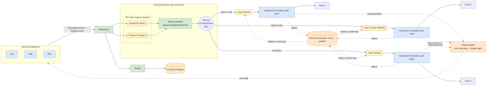

**Routing topology quick‑reference:**

| Scenario | How it's modeled |
|---|---|
| 1 input → multiple outputs | **One contract** with multiple entries in `Outputs`. |
| Multiple inputs → same outputs | **One contract** with multiple entries in `Inputs` (all sharing one `Format`, INV‑2). |
| Multiple inputs → different output sets | **One contract** with `FromInputIds` on each output to declare which inputs route to it (per‑leg input filter, §3.3/§3.4). Example: Input 1 → Output A only; Input 2 → Output A + Output B. |
| Same input → two different output groups | **Not supported** — one input can only belong to one contract (INV‑3). Split the source into two input comm points, each routing to its own contract. |

---

## 2. Design Principles

- **P1 — One message, one envelope, no side‑channels.** All per‑message state (payload, headers, correlation id, timestamps, ack token, `ReplyContext` reference) lives on `MessageContext`. Fan‑out clones it per leg (shared immutable payload). No global mutable correlation dictionaries.
- **P2 — Ownership boundaries: transport / topology / processing / delivery / policy.** Endpoints own transport + wire encoding (codec); Dispatcher+Router+Registry own topology; the shared pipeline owns message processing; legs own delivery; strategies own policy. No component reaches across a boundary.
- **P3 — The reply is owned by the source, coordinated once per message by the `ReplyContext`.** The inbound endpoint that owns the source connection is the only thing that writes back (via `IAckToken`). *When/what* to reply (ack **or** response) is decided by the per‑message **`ReplyContext`** + `IAckStrategy` over the **required** legs' `DeliveryResult`s. The reply is orthogonal to durability.
- **P4 — Queues are owned by the ContractRuntime (one per input) and the Legs (one per output) and are always bounded.** Every endpoint — input or output — owns its own queue. Bounding is mandatory; overflow policy is per‑queue. Backpressure is a feature.
- **P5 — Durability is a channel implementation detail; delivery guarantee is a per‑leg policy.** In‑memory vs journal‑backed is chosen per leg behind one `IMessageChannel` interface. Each leg is independently at‑most‑once or at‑least‑once.
- **P6 — Extensibility is closed‑for‑modification.** New protocols, stages, outputs, codecs, ack/retry policies are *registered*, never coded into the engine (OCP).
- **P7 — Failure isolation is per leg and per message.** A poison message is quarantined in the store‑and‑forward buffer as `Parked` (never dropped, never looped forever) and replayed **into that leg only**. Output isolation is **complete for optional legs**; a slow/dead **required** leg couples its contract via fan‑out backpressure by design (a configurable per‑leg `OnFull` policy to decouple it is a deferred improvement — §5, Future Improvements).
- **P8 — Configuration declares topology and limits; code defines behavior.** Config models are pure DTOs — no delegates.
- **P9 — Deterministic, observable lifecycle.** Start/drain/shutdown order is explicit and testable; every stage + leg emits metrics/spans; per‑queue depth is observable.
- **P10 — Simplicity first.** `System.Threading.Channels` + a small local journal; no external broker/actor framework unless a requirement forces it. The queue's backing data structure is swappable behind `IMessageChannel` (bounded channel now; partitioned/ring‑buffer later only if profiling demands).

**Invariants (hard rules the engine upholds):**

- **INV‑1 — One input, one format.** An input comm point emits exactly one message `Format`; it is never mixed on one input.
- **INV‑2 — A contract is single‑format.** All inputs of a contract share the same `Format`; the contract's one shared pipeline and its ack formatter are chosen by that `Format` (validated at load). Two formats ⇒ two contracts.
- **INV‑3 — One message → one contract.** The Router resolves a message to exactly one contract; multi‑destination is handled by fan‑out (M outputs), never by a message living in several contracts.
- **INV‑4 — No reply conversion.** A source is replied to **in its own `Format`**; ack and request‑reply responses are pass‑through. Cross‑format conversion is out of scope for now (future).
- **INV‑5 — Parse once, serialize per leg.** The message travels as a **canonical model**; wire→model parsing happens **once** at ingress; model→wire serialization happens **per leg** in the codec.
- **INV‑6 — One reply per received message, owned at reception.** The single ack/response is owned by the per‑message **`ReplyContext`**, created when the message is received — not per contract.

---

## 3. Component Breakdown

### 3.1 Inbound Endpoint (`IInboundEndpoint`)
- **Responsibilities:** listen/accept/poll; deframe into a `MessageContext`; admission control (bounded concurrency); mint the `IAckToken` bound to its own connection; hand to the Dispatcher.
- **Interface:** `StartAsync(ct)`, `StopAsync(ct)`.
- **Lifecycle:** `IHostedService`. Starts after ContractRuntimes are built; stops **first** on shutdown.
- **Never does:** routing, output sending, HL7 business logic.

### 3.2 Dispatcher (`IMessageDispatcher`) — *coordinator (fresh messages only)*
- **Responsibilities:** receive a fresh `MessageContext`, ask the Router for the **one** matching contract, enqueue onto that contract's **per‑input ingress queue** (keyed by `SourceEndpointId`).
- **Interface:** `Task DispatchAsync(MessageContext, ct)`.
- **Never does:** routing *logic*, processing, per‑message state, **or retry replay** (replay is leg‑targeted, §3.9 — the Dispatcher is not a retry hub).

### 3.2a Router (`IContractResolver`) — *routing decision (Strategy)*
- **Responsibilities:** pure `MessageContext → IContractRuntime` (**exactly one**, INV‑3). `SourceBasedRouter` (default) by `SourceEndpointId`; `ContentBasedRouter` (future) by field/header — still resolves to one contract per message.
- **Interface:** `IContractRuntime Resolve(MessageContext)`.

### 3.2b Contract Registry (`ContractRegistry`) — *compiled‑contract lookup*
- **Responsibilities:** hold all compiled `IContractRuntime`s and the `inputCommPointId → IContractRuntime` index (O(1), source‑based). Queried by the Router; makes no decisions. A concrete class in `Core` — not behind a cross‑layer interface, since (unlike the Router) it has one implementation and no planned alternative.
- **Note (naming):** distinct from the config **Catalog** (§8, named pipelines, codecs, formats, and templates) and the **Component Registry** (§3.10, type→impl factories). Three different lookups, three different names — see §3.10.

### 3.3 ContractRuntime (`IContractRuntime`) — *shared reception + fan‑out*
- **Responsibilities:** own **one ingress queue per input comm point** (keyed by input id — symmetric with per‑leg queues on the output side); each per‑input queue has its own consumer(s) that run the **shared pipeline** once per message (on the canonical model) and **fan out** (clone per leg, enqueue into each **applicable** leg queue concurrently); own the set of **Delivery Legs**. It **reports** each leg's `DeliveryResult` into the message's `ReplyContext` — it does **not** own the reply or decide reply timing.
- **Per‑leg input filter (`FromInputIds`).** Each leg may optionally declare which input comm points it accepts. At fan‑out the ContractRuntime **skips** legs whose `FromInputIds` does not include the message's `SourceEndpointId`. A null/empty `FromInputIds` means "accept all inputs" (default — backward compatible). The **`requiredCount`** armed on the `ReplyContext` is computed **per‑message** (count of matching required legs), so the reply is correct regardless of which subset of legs runs.
- **Per‑leg content filter (`RouteWhen`).** A leg may optionally declare a `RouteWhen` — a set of `key: value` facts matched (AND, exact ordinal) against the message **`Headers`**. At fan‑out a leg with `RouteWhen` is included only when **every** pair matches; legs without `RouteWhen` are unconditional (the catch‑all). Facts are written by a **classifier stage** in the shared pipeline (developer‑owned); Core does only a dumb string compare, so it stays content‑agnostic. `RouteWhen` composes with `FromInputIds` (a leg must pass **both**), and the per‑message `requiredCount` reflects the routed subset. A message matching **no** leg is a **filtered drop** (observable via the filtered‑message metric, `reason = "no route matched"`) — not a silent success; add a catch‑all output for guaranteed delivery. See §3.4a.
- **Interface:** `ValueTask EnqueueAsync(MessageContext, ct)` (routes internally to the per‑input queue by `SourceEndpointId`), `Task RunAsync(ct)`, `Task DrainAsync(timeout)`.
- **Per‑input isolation:** each input gets its own `Capacity`, `DegreeOfParallelism`, and `OverflowPolicy`. A bursty input fills only its own queue; other inputs' queues (and their consumers) are unaffected. This mirrors per‑leg isolation on the output side.
- **Never does:** protocol/transport work, reply byte‑writing, reply timing (all owned by the `ReplyContext`, §3.8/§6).
- **Why:** the unit that maps a Contract's N inputs to M outputs, and the place shared work happens exactly once. Per‑input queues give per‑source backpressure, ordering, and observability. Per‑leg input filtering gives per‑input routing within a contract.

### 3.4 Delivery Leg (`DeliveryLeg`) — *one output*
- **Responsibilities:** own **its own queue** (`IMessageChannel`, bounded or durable), its **outbound endpoint** (+ Retry/Batching decorators; the endpoint **serializes** the canonical model to the destination format via its codec), its **delivery guarantee**, **retry**, and **store‑and‑forward** (failure buffer). Report each message's `DeliveryResult` to the message's `ReplyContext`. Accept **leg‑targeted replays** from the `ForwardWorker` (§3.9). **No per‑leg processing pipeline** — processing runs once in the shared pipeline; a leg only encodes + delivers.
- **Interface:** `ValueTask EnqueueAsync(MessageContext)`, `ValueTask ReplayAsync(MessageContext)`, `Task RunAsync(ct)`, `Task DrainAsync(timeout)`, `bool Required`, `IReadOnlySet<int>? FromInputIds`, `IReadOnlyDictionary<string,string>? RouteWhen`, `bool AcceptsMessage(headers)`.
- **`FromInputIds`** (optional) — if set, this leg only accepts messages originating from the listed input comm points; the fan‑out in ContractRuntime skips it for other inputs. Null/empty = accepts all inputs (default).
- **`RouteWhen`** (optional) — if set, this leg only accepts messages whose `Headers` match every `RouteWhen` fact (AND, exact ordinal); the fan‑out includes it per message. Null/empty = accepts all messages (default). See §3.4a.
- **Never does:** write the reply to the source, know about other legs.

### 3.4a Content routing (classify vs route)
Content‑based routing is split so no single author needs to know **both** the message internals and the deployment topology:
- **Classify (developer, code).** A classifier `IMessageStage` in the shared pipeline inspects the parsed message and writes **domain facts** into `MessageContext.Headers` using a documented, per‑format vocabulary (e.g. `hl7.messageType = "ADT"`). It **never references an output** — not by id, label, or type — so one classifier works across every deployment. (Protocol parsing stays in the format module; Core never parses content.)
- **Route (FSE, config).** Each output declares an optional **`RouteWhen`** = the facts it accepts. The FSE — who owns the outputs — binds facts → outputs. Matching is dumb string equality (AND over all pairs) in Core.
- **Fan‑out (engine).** Applicable legs = source‑applicable (`FromInputIds`) **∩** `RouteWhen` matches; the reply is armed with that subset's required count. Contracts declaring **no** `RouteWhen` keep the precomputed zero‑allocation fast path (**pay‑only‑if‑used**). A message matching no leg is a **filtered drop** (`reason = "no route matched"`); provide a `RouteWhen`‑less catch‑all output for guaranteed delivery.

**Ownership:** code decides *what the message is*; config decides *where it goes* — the same split as pipelines/codecs (developer) vs topology (FSE). The concrete HL7 classifier stage is **future work** (see `docs/vaibhavToDoList.md`); the `RouteWhen` mechanism itself is in place.
- **Why:** per‑output isolation of progress, durability, concurrency, ordering, retry, and ops. (Isolation is complete for **optional** legs; a slow **required** leg couples the contract via fan‑out backpressure — §5.)

### 3.5 Message Channel (`IMessageChannel`) — *queue + durability seam*
- **Used by every per‑input ingress queue and every per‑leg queue.** `EnqueueAsync`, async reader, `Complete()`.
- Implementations: `BoundedInMemoryChannel` (AtMostOnce; overflow `Wait`/`Reject`), `DurableChannel` (AtLeastOnce; journal + commit‑after‑delivery; overflow `SpillToDisk`). `PartitionedChannel`/`RingBufferChannel` are **deferred** future backings behind the same interface (only if profiling demands — see Future Improvements).
- **Why:** the one seam where in‑memory vs persistent vs (future) broker is chosen, per queue.

### 3.6 Pipeline (`IMessagePipeline`) + Stage (`IMessageStage`) — *per‑message processing*
- The **shared pipeline** is an **ordered list of `IMessageStage`s** (pipeline‑driven — the pipeline calls each stage and reads its returned `StageResult`) that runs **once per message** before fan‑out. A stage may short‑circuit (filter), mutate headers (enrich), or replace the canonical model (a shared transform).
- **How a stage filters (drops a message).** A stage **returns** its decision, so it cannot forget to continue and silently skip the rest (that whole class of bug is designed away):
  1. **`return StageResult.Filter(reason)`** — **preferred** for routine dedup/rule‑based drops: allocation‑free and carries a low‑cardinality `reason` for observability (otherwise `return StageResult.Continue`).
  2. **`throw PipelineFilteredException(reason)`** — reserve for **exceptional / hard stops** a stage can't handle locally; an exception per routine drop is costly at volume.
  Both surface as `PipelineResult.Filtered(reason)`; the `ContractRuntime` stops fan‑out, replies per the contract's `ReplyOnFilter`, and records the drop **with its reason** on the `ibe.agent.messages.filtered` metric. A filter stage should also **log its own drops** (with the message's identifiers) — parity with the legacy filter.
- **Canonical model (INV‑5).** The first stage **parses** the source's wire bytes into a **canonical in‑memory model** (a lazily‑parsed typed view cached on the `MessageContext`, see §3.6b); later stages work on that model. Parsing happens **once** here — never per leg. Because of **INV‑1** (one input, one format) the parser is unambiguous.
- All message processing lives here — there is **no per‑leg pipeline** (YAGNI). Destination **wire serialization** is *not* a stage; it is the outbound endpoint's **codec** (§3.7). Delivery is the leg consumer calling the endpoint, *not* a `DeliverStage`.
- **High‑fidelity (no‑stage) fast path.** A contract with no stages compiles to an **empty pipeline** — the *identity* case of the same mechanism, **not** a separate mode (no `HighFidelityContractRuntime` fork). `ExecuteAsync` returns a **`ValueTask<PipelineResult>`** that completes **synchronously with zero `Task` allocation** when there are no stages (and also when every stage completes synchronously). So the ~80% pass‑through case pays no pipeline cost while the code path stays uniform.
- **Protocol‑agnostic stages, protocol‑specific extractors (F24).** Generic stages key off neutral headers — e.g. `DeduplicateStage` reads a generic **`IdempotencyKey`** header; an **HL7‑specific extractor stage** (in the HL7 module) populates it from `MSH‑10`. No HL7 identifiers leak into the engine.
- **Never does:** own transports. Transport‑agnostic.

### 3.6a Parallel stages (Scatter‑Gather) — *deferred (future)*
> **Status: NOT IMPLEMENTED — deferred (YAGNI).** The shared pipeline is **linear** today: `MessagePipeline` runs an ordered `IMessageStage` list one stage after another. There is **no `ParallelStage` type and no `parallel` catalog token** in the current codebase — a catalog `Pipelines` entry is a plain ordered **list of stage names**. The concurrency design below is kept as the intended future extension, to be built only when a real, profiled need justifies it.

Even while the pipeline is linear, one level of parallelism needs **no framework support**:
- **Internally parallel stage** — any `IMessageStage` may `Task.WhenAll(...)` its own independent async calls inside `ProcessAsync`.

**Future — `ParallelStage` (composite, pluggable).** When needed, a composite stage that *is itself* an `IMessageStage` (Composite pattern) will hold N **branches** (each branch a sequential mini‑pipeline), run them concurrently, **join**, and return one `StageResult`. Because it is just another `IMessageStage`, it plugs into `MessagePipeline` without changing the engine or the stage contract — this is the **Scatter‑Gather** EIP pattern. Intended rules when it lands: branches return *contributions* applied sequentially at the join in **fixed branch order** (deterministic, race‑free); **at most one** branch transforms the payload; join policy `all`, error policy `failFast` (with `any`/`quorum`/`bestEffort` further deferred). At that point the catalog `Pipelines` list would gain a nested `parallel` token.

**When it will be worth it:** genuinely independent, **latency‑bound** work (cache/DB/HTTP lookups) — **not** cheap CPU transforms (scheduling overhead can exceed the gain). For raw throughput prefer per‑leg `DegreeOfParallelism` or batch‑level parallelism (`S3BatchProcessor` already maps a batch across K workers).

### 3.6b Canonical message model (what stages and codecs operate on)
The transport layer stays byte‑neutral, but the **processing** layer needs a defined shape (previously implicit — now explicit, closing the "undefined model" gap):
- **`Payload`** — the source's **canonical bytes** in its own `Format` (what arrived on the wire). Immutable after the shared pipeline.
- **`Format`** — a **per‑input** tag (INV‑1) that selects the parser, the stages, and the ack formatter.
- **`Headers`** — a neutral `string→string` bag for cross‑stage metadata (e.g. the generic `IdempotencyKey`). **Mutable during the shared pipeline** — enrich/extractor stages add and populate headers there. At fan‑out the per‑leg clone shares the **same** bag **by reference** and legs/codecs treat it as a **read‑only snapshot** (no leg mutates it), so no copy is allocated per leg. This is the header lifecycle the envelope (§13) and clone (§4 step 4) assume (A5).
- **Parsed view** — an optional, lazily‑built typed model (e.g. a parsed HL7 message) cached on the `MessageContext` by the parse stage so stages don't re‑parse; built **once** (INV‑5).
- **Serialization** — **codecs serialize from this model, per leg**. A **same‑format** output re‑serializes / passes through; a **known mapping** (HL7→Avro) is done by the batch codec. **Cross‑family conversion (e.g. HL7→FHIR) is out of scope** (INV‑4) and rejected by validation (§8).

> **Why not serialize once, before fan‑out?** Because different legs need **different** wire formats (HL7 to the EHR, Avro to S3). A single pre‑fan‑out serialization would force one format on every destination. So: **parse once (shared), serialize many (per leg).**

### 3.7 Outbound Endpoint (`IOutboundEndpoint`) + Codecs (`IMessageCodec` / `IBatchCodec`) — *transport + serialization*
- **Interface:** `Task<DeliveryResult> SendAsync(MessageContext, ct)`. Owns a **pooled/persistent** connection, **tunable per endpoint** from the FSE's comm‑point config (§8): TCP `PoolSize`; HTTP `MaxConnectionsPerServer` + `PooledConnectionLifetimeSeconds` / `PooledConnectionIdleTimeoutSeconds`. **Encoding to the destination's wire format is the endpoint's job (via a codec), not a pipeline stage.**
- **Message codec (`IMessageCodec`) — per‑message serialization:** turns the **canonical model** (§3.6b) into the destination's wire bytes. Same‑family output (HL7→HL7) re‑serializes / passes through; the known **HL7→Avro** mapping is a batch codec; **cross‑family conversion is out of scope** (INV‑4). A leg's **resolved `Encoding`** comes from the contract's `Template` (its `Format` → a **catalog `Codecs` entry**, §8), or an inline `Encoding` override — either way binding a registered codec type to its params, extendible without touching the engine (OCP). An endpoint with a single fixed format uses its default codec.
- **Batch codec (`IBatchCodec`) — per‑batch encoding (N → 1):** batch‑native sinks encode a whole batch into one artifact. `AvroZipBatchCodec` (HL7→Avro→DEFLATE→zip) wraps the existing `S3BatchProcessor` unchanged; `NdJsonBatchCodec`, `FhirBundleBatchCodec`, `CsvBatchCodec` … are drop‑in. A leg's **resolved batch codec** comes from its `Format`'s `BatchCodec` (or an inline `Batching.Codec` override) — a **catalog `Codecs` entry**.
- **Decorators:** `RetryingOutboundEndpoint` (Polly), `BatchingOutboundEndpoint` (size/time flush), `TelemetryOutboundEndpoint`.
- **Nagle disabled (`NoDelay`) on both ends of the MLLP round‑trip:** MLLP request‑reply is a small‑write → wait‑for‑small‑ack ping‑pong, so Nagle + delayed‑ACK otherwise stalls each message ~40 ms. Every socket on the hot path sets `TcpClient.NoDelay = true`: the outbound pool's dialed connections **and** the inbound endpoint's accepted sockets (§3.1). (HTTP endpoints inherit `NoDelay` from `SocketsHttpHandler`'s default; no explicit setting needed.)
- **Stale‑connection resilience (transport‑level, guarantee‑agnostic):** a pooled/persistent connection can be closed by the peer while idle (downstream idle‑timeout, firewall/NAT reaping) — and `TcpClient.Connected` still reports `true` for such a half‑open socket, so the pool can hand out a **dead** connection. On a **reused** connection a transport failure (`SocketException`/`IOException`, or a stream that closes before an ack) is therefore treated as a **pool artifact, not a delivery rejection**: the endpoint discards it and **transparently retries once on a freshly‑dialed connection**. A **freshly‑dialed** connection that fails is a genuine downstream error (no retry, no loop). This is **duplicate‑safe** — bytes written to a peer‑closed socket are RST'd, never delivered to the downstream application — and applies to **every** delivery guarantee, **including `AtMostOnce`** (which has no store‑and‑forward retry). It is therefore **independent of** the durable retry subsystem (§3.9): *connection hygiene lives at the transport; delivery retry/backoff lives at the leg.* (A proactive liveness probe / idle eviction is a complementary future refinement; the reconnect‑once path is the correctness guarantee.)
- **Request‑reply (send‑and‑receive):** a *responder* endpoint additionally **captures the peer's reply** and returns it on `DeliveryResult.ResponsePayload` (+ its `Format`). Most adapters already have the reply in hand (MLLP reply frame / HTTP response body); it feeds **enhanced ack** (which relays it straight back to the source on success, §6) and **request‑reply** (which surfaces it back to the source, §6.1).
- **Never does:** ack the source, route, or know about contracts.

### 3.7a Where batch processing happens (per‑leg, after fan‑out)
Batching is a **per‑destination delivery concern**, so it lives on the **leg, after fan‑out** — never as a shared step before the legs (a shared batch would force one batch policy on every output and blur per‑leg failure/ack). Per‑message processing (validate/filter/enrich) runs **once** in the shared pipeline; then the **S3 leg** accumulates a batch (drain by size/time from its own queue — the queue *is* the batch buffer), hands it to its **batch codec** (from the leg's `Format` → `BatchCodec`), and uploads. Non‑batch legs (TCP/File) encode and deliver per message via their `IMessageCodec`. Each leg keeps its own batch policy, codec, failure isolation, and ack outcome.

**The batch operation is a codec, not a pipeline.** It is inherently **N messages → 1 artifact** — a different cardinality from a per‑message stage — so it belongs to the endpoint's `IBatchCodec`, pluggable and extendible: `avro-zip` (wraps `S3BatchProcessor`) today; `ndjson`, `fhir-bundle`, `csv` … by registration.

**Two independent "batch" directions — don't conflate them:**

| | Direction | Where | Mechanism |
|---|---|---|---|
| **Inbound batch** | a source sends an HL7 `BHS`…`BTS` batch | **input** comm point | de‑batch into individual messages + batch **ACK shape** (`AckShape.Batch`, §6) |
| **Outbound batch** | the engine accumulates N messages → 1 artifact for a sink | **output** leg | `Batching { Enabled, MaxCount, MaxLatencyMs }` (triggers, FSE) + `IBatchCodec` (from the `Format`) |

These are opposite ends and fully independent: a contract can de‑batch an inbound `BHS` group *and* re‑accumulate an outbound Avro batch, or do either alone.

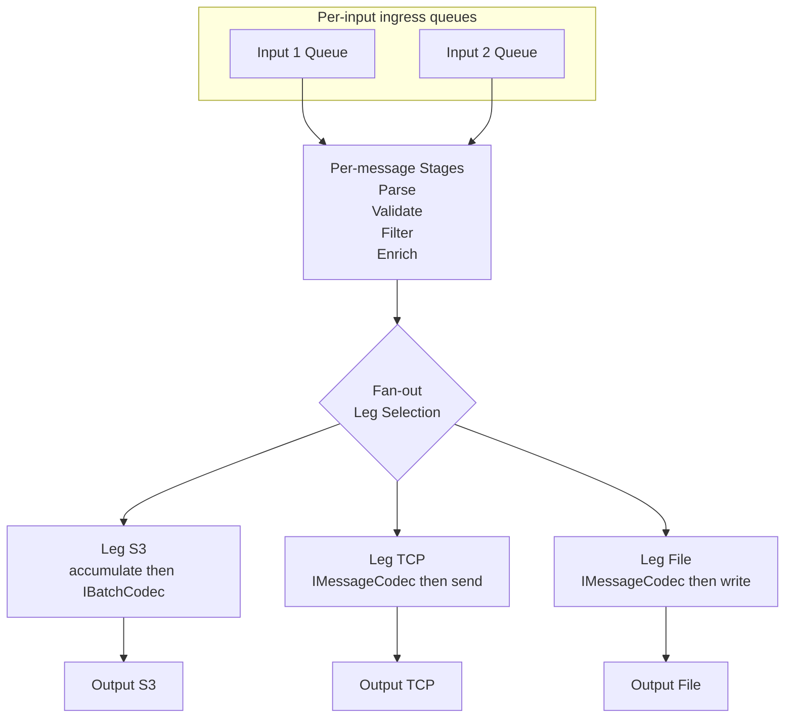

### 3.8 Reply subsystem (`IReplyContext`/`ReplyContext`, `IAckStrategy`, `IAckFormatter`, `IAckToken`)
The single reply to a source message is owned by the per‑message **`ReplyContext`** (created at reception, INV‑6) and split into **orthogonal, pluggable concerns** over a neutral **`DeliveryResult`** (outcome **+ optional response bytes + format**). The engine stays payload‑neutral.
- **`IReplyContext` / `ReplyContext`** (per received message) — the reply authority, split into a **seam** and its **implementation** (A2/A3): the `IReplyContext` interface is declared in `Abstractions` and is the *only* thing `MessageContext.Reply` references, so the envelope never depends on the engine; the concrete `ReplyContext` lives in `Core`. Its surface is **`OnFannedOut(requiredTotal)`** (arm the per‑message applicable‑required count), **`ReportFiltered()`** (shared‑pipeline short‑circuit), and **`ReportLeg(required, DeliveryResult)`** (A4). It collects each leg's `DeliveryResult`, applies the strategy over the **required** legs, fires **exactly once** (`Interlocked` one‑shot), and owns the **reply timeout** (§6 / §6.1). For enhanced ack over multiple required legs, **all required must succeed**. It replaces the old per‑contract `DeliveryAggregator` (which risked a **double‑ack** under multi‑contract routing — impossible now under INV‑3, and guarded here regardless).
- **`IAckStrategy`** — *when/what*: **Normal** (a **generated** "received" ACK, on durable receipt) vs **Enhanced** (on success **relays the destination comm point's own acknowledgement** back to the source after delivery — the positive ack bytes always come **from the output comm point**, never engine‑generated; only a required‑leg **failure** falls back to a **generated** negative ACK). Both selected per contract via `{ IsEnabled, IsEnhanced }`. A third strategy, **Response** (request‑reply, `ResponseReplyStrategy`), writes the responder leg's **captured payload** *instead of* an ACK (see §6.1). **A positive Enhanced ack and a Response therefore both surface the output comm point's bytes** — they differ only on failure (enhanced → generated negative ACK; response → protocol‑error reply) and in intent (a transport ack vs. a business response).
- **`IAckFormatter`** — *format + shape*: renders a **generated** ack's **bytes** in the **source's own** `Format` and **shape**, selected by a **(`Format` × `Shape`)** pair. Shapes are **subclasses of the abstract formatter** — `Hl7SingleAckFormatter` (today), `Hl7BatchAckFormatter`, … — and the shape is a **config choice** (`AckShape`, §6/§8), **not** auto‑detected from framing. Per **INV‑4** a source is always answered in its own type — **no conversion**. *(A positive **enhanced** ack and a **response** already carry the destination's own bytes and **skip the formatter**; the formatter renders only the **generated** replies — **Normal** acks, an enhanced **negative** ACK, and **batch** ack shapes.)*
- **`IAckToken`** (protocol‑bound, on the context) — **writes reply bytes** back over *this* source transport (MLLP frame / HTTP response / file move): `Task WriteAsync(ReadOnlyMemory<byte> reply, ct)`. It carries **content**, not just a status, so generated acks, pass‑through acks, and request‑reply responses can all reach the socket.
- **Never does:** the token never decides policy or format; the strategy/formatter never touch sockets.

> **Message‑type extensibility (HL7‑only today):** the engine is neutral (payload = canonical bytes, leg result = `DeliveryResult`); each **input** carries a `Format` (INV‑1) that selects the parser, stages, and source `IAckFormatter`. Adding FHIR/XML later is "register a parser + stages + a formatter," no engine change.

### 3.9 Store‑and‑Forward (`IForwardStore`, `ForwardWorker`) — *one subsystem; retry buffer + terminal `Parked` state*
> **One mechanism, not two.** The legacy split — an in‑process "DLQ" idea vs. the standalone forward service — collapses into a **single store‑and‑forward subsystem**. There is **no separate "dead‑letter queue" component**; dead‑lettering is simply the terminal **`Parked`** state of the one forward store. This is what the old DLQ was *meant* to be, under the forward‑service name.
- **The store (`IForwardStore`) — one durable buffer, tagged by `OutputId`.** Generalizes the legacy `FailureMessageStore` + `IDatabaseUtils` + Postgres table into a first‑class store with a real lifecycle. Rows: `Id`, `Message` (**the post‑pipeline canonical payload + header snapshot for that leg**, encrypted at rest via DPAPI `DataDecipher` — persisting the *already‑processed* form is what lets **any** host re‑encode via the leg's codec and re‑deliver **without** re‑running the shared pipeline or touching the source; INV‑5), `OutputId` (was the ad‑hoc `SenderId` → now the leg id), `Status` (`Pending` | `Parked`), `Attempts`, `NextAttemptAt`, `LastError`, `CreatedAt`. `Pending` = still being retried (the store‑and‑forward role); `Parked` = terminal poison quarantine (the old "DLQ" role). Surface: `StoreAsync(ctx, outputId, error)`, `ResolveAsync(ctx, outputId)` (success → delete), `FetchDueAsync(max)`, `RescheduleAsync(id, attempts, nextAttemptAt, lastError)`, `ParkAsync(id, reason)` (→ `Parked`).
- **The worker (`ForwardWorker`) — one always‑on retry loop.** Reads `Pending` rows whose `NextAttemptAt` is due, replays each to **its own leg**, then either `ResolveAsync` (delivered), `RescheduleAsync` with **exponential backoff** (transient), or `ParkAsync` after the **max‑attempts cap** (poison). This adds to the legacy 30‑minute sweep exactly what it lacked: an attempt cap, backoff/scheduling, and a terminal state — so nothing retries forever and nothing is silently dropped. **Any** leg type is replayable (this fixes the legacy File orphan, whose type had no case in the old `switch`).
- **Replay invariants (critical):** a replay **targets one leg only** — it **never** goes through the Dispatcher, **never** re‑routes, **never** re‑runs the shared pipeline, and **never** produces a second reply (the reply was already settled). Only the failed leg is re‑sent; already‑succeeded legs are untouched (no duplicates), and no shared processing is repeated.
- **Reuse the engine's delivery path — no duplicate senders.** Replays go through the **same** `IOutboundEndpoint` + codec the engine uses; the legacy duplicated `TcpRetrySender`/`HttpRetrySender` are deleted. In‑process the worker hands to `DeliveryLeg.ReplayAsync` (re‑enqueues into the live leg queue); out‑of‑process it builds the leg's endpoint from the shared libraries and sends directly. Both honor the replay invariants.
- **One store, one worker, one active owner.** The store lives in the shared `Philips.IBE.IBEAgent.Persistence` library; the `ForwardWorker` is **one implementation** with **two hosting modes**, of which **exactly one is the active owner** (config `Forward:Owner`): `ForwardService` (default — out‑of‑process in `Philips.IBE.IBEAgent.ForwardService`, the modern replacement for the legacy `CimS3ForwardService`; survives agent downtime, isolates heavy S3/CIM retry) **or** `InProcess` (co‑located in the agent; lowest latency, no extra process). The **store is the seam**; a row lease (`SELECT … FOR UPDATE SKIP LOCKED`) is a **safety net** (not the primary mechanism) so an accidental double‑enable can never double‑send. Inline transient retry (Polly, seconds) always lives in the leg's decorator regardless of owner; the store‑driven `ForwardWorker` is only the *durable, exhausted‑retry* half.

**Keep it one implementation, not a fork — three hard invariants:**
1. **Store the already‑processed, per‑leg form.** Rows hold the **post‑pipeline canonical payload + header snapshot + `OutputId`** (INV‑5) — never raw inbound bytes — so replay **never** re‑runs the shared pipeline, re‑routes, or touches the source, in either host.
2. **One worker, two hosts, a single owner.** The retry / backoff / park logic exists **once**; hosting is a config choice; the lease guards against double‑send. There is no second delivery code path to keep in sync.
3. **Reuse the engine's delivery stack.** Replay delivers through the **same composed `IOutboundEndpoint` + codec (+ Retry/Telemetry decorators)**, built by the **same factory from the same config** — in‑process via `DeliveryLeg.ReplayAsync` (leg queue), out‑of‑process via an identically‑composed endpoint. The legacy `TcpRetrySender`/`HttpRetrySender` stay deleted.

**Edge cases pinned down now (so they don't become future hurdles):**
- **Only `AtLeastOnce` legs use the store.** `AtMostOnce` legs do **not** persist on failure (that *is* their contract — the source resends on a missing ack), keeping the store bounded to exactly what must be durable.
- **Out‑of‑process forwarding is for *unordered* legs only.** An `Ordered` leg keeps replay **in‑process and in‑order** (park‑and‑halt the key, §5); a later out‑of‑process re‑send would violate per‑key order. The compiler rejects `Ordered` + `Forward:Owner=ForwardService` on the same leg.
- **Crash‑safe outbox ordering:** deliver → confirm → *then* `ResolveAsync` (delete). A crash between send and delete re‑delivers on restart (at‑least‑once) — it **never loses** — and the downstream `DeduplicateStage` / `IdempotencyKey` absorbs the rare duplicate; `ResolveAsync` is idempotent.
- **At‑rest crypto is machine‑scoped (DPAPI).** The active owner **must run on the same machine** as the agent that wrote the row (co‑location is a deployment invariant); a future multi‑host split requires moving the store to a shared key/cert — flagged here so it isn't discovered in the field.
- **Config drift is tolerated, never fatal.** Both hosts read the **same** `config/` through the shared `Configuration` library; an `OutputId` that no longer resolves is **parked with a reason**, never crashes the worker.
- **State‑bound legs degrade cleanly.** A forwarded **responder (request‑reply) leg** delivers to the peer but the **response is dropped** (the source is long gone, §6.1); **batch codecs must be pure** (a function of the stored entries) so the `ForwardService` can re‑encode a batch with no live accumulator state.
- **`Parked` has an explicit ops lifecycle.** `Requeue` (→ `Pending`, reset `Attempts`) and `Discard`, surfaced by the Web service (which shares the `Persistence` read‑model), plus a retention/purge policy — poison rows never silently accumulate forever.

### 3.10 Supporting infrastructure
- **Configuration subsystem** (§8), split into two layers so the Web service can share it without pulling in the engine:
  - **`Philips.IBE.IBEAgent.Configuration` (pure, shared):** typed option DTOs, the **Catalog** DTOs (named pipelines, codecs, **formats**, and **templates**), the **`ContractTemplateResolver`** (flattens a contract's `Template`/`Format` references into concrete per‑leg encodings before compilation), `IValidateOptions` **structural** validators (unique ids, single‑format INV‑2, ack XOR response, capacity/DOP > 0, referential integrity, template/format resolution), and the generated **JSON schema/manifest**. Depends only on `Abstractions`. Referenced by **both** the agent Host **and** the Web service → one source of config truth.
  - **Compiler + registry (in `Core`):** `ContractCompiler`/`PipelineBuilder` (config → `IContractRuntime` + legs) and the **Component Registry** — name/type‑keyed factories for endpoint, stage, **codec (`IMessageCodec`/`IBatchCodec`)**, and **`IAckFormatter` (by `Format` × `Shape`)**. Name‑resolution validation (names → registered impls, encoding⇄format compatibility) runs at startup where the registry exists. New protocols, stages, codecs, and ack shapes stay plug‑and‑play (register + name, don't edit).
- **Three lookups, three names (avoid confusion):** the **Contract Registry** (§3.2b — compiled contracts by input) ≠ the **Catalog** (§8 — config building blocks by name) ≠ the **Component Registry** (here — type→impl factories).
- **Telemetry**: OTel metrics/spans per stage + per leg; per‑input and per‑leg queue depth gauges; store‑and‑forward counters (pending/parked); `contract.mode`, `leg.mode` diagnostics.
- **Logging** — structured (named placeholders only, never string interpolation), correlated by `CorrelationId`, and driven by **`Logging:LogLevel` in `appsettings.json`** (the `NLog` rules stay permissive at `Trace`, so the `Microsoft.Extensions.Logging` category filter is the single gate). Full message‑body logging is confined to **Trace** and guarded by `ILogger.IsEnabled(LogLevel.Trace)`, so the payload decode/allocation never runs unless Trace is enabled — **zero cost otherwise**. No secrets/PII are logged except the full body at Trace (PHI; dev/troubleshooting only). The `Philips.IBE` category level selects the tier:

  | Level | What you see |
  |---|---|
  | **Trace** | Full **inbound** message body (at receipt), full **outbound** message body (at delivery), and full **ack/response** body (at the ack token). |
  | **Debug** | Internal diagnostics — accept‑loop shutdown, store‑and‑forward sweep/reschedule, and other infra detail not needed for normal production investigation. |
  | **Information** | Per‑message flow — **received / delivered / filtered / ack‑sent** — correlation‑based, with **end‑to‑end** latency (reception → delivery); plus **HL7 id/type** (MSH‑10 / MSH‑9) when the opt‑in `hl7-classify` stage is in the contract's pipeline. The production monitoring level. |
  | **Warning** | Problems only (delivery/reply failures, store‑and‑forward `Parked`, missing ack formatter). |

  **High fidelity is a level, not a flag:** a max‑throughput deployment sets `Philips.IBE → Warning` (no per‑message lines) and omits the `hl7-classify` stage (no parse) — two independent knobs (log cost = level; parse cost = pipeline composition). Engine libraries log through the `ILogger` abstraction only; `NLog` is wired in the hosts.
- **Host / composition root**: build config → compile `IContractRuntime`s+legs → register endpoints → start host.

---

## 4. End‑to‑End Message Flow

Ownership in **bold**.

1. **Reception** — **Inbound Endpoint** deframes one message, acquires an admission slot, mints `MessageContext` (+ `IAckToken` + a per‑message **`ReplyContext`** that owns the one‑shot and timeout).
2. **Dispatch** — **Dispatcher** asks the **Router** for the **one** matching `IContractRuntime`; enqueues onto that contract's **per‑input ingress queue** (keyed by `SourceEndpointId`; `EnqueueAsync` awaits if that input's queue is full = per‑input backpressure).
3. **Shared processing** — a **per‑input consumer** pulls the message from its input's queue and runs the **shared pipeline** once (parse → validate/filter/enrich on the canonical model). If short‑circuited (filtered/invalid) → the `ReplyContext` replies `Filtered` and stops; no leg runs.
4. **Fan‑out** — the ContractRuntime computes the **applicable legs** for this message (filtering by each leg's `FromInputIds` against the message's `SourceEndpointId`; legs with null/empty `FromInputIds` always apply), **arms the `ReplyContext`** with the **per‑message required count** (count of applicable required legs), clones the context per applicable leg (sharing the immutable payload + a read‑only header snapshot), and enqueues into **each applicable leg's queue concurrently** (`Task.WhenAll`). Non‑matching legs are skipped entirely. A full *required* leg backpressures here (couples that input — §5); a full *optional* leg follows its own overflow policy.
5. **Per‑leg delivery** — each **Delivery Leg** consumer **delivers** via its outbound endpoint, which **serializes the canonical model to the destination format** (`IMessageCodec`, or accumulate + `IBatchCodec` for batch sinks); Retry/Batching decorators inside. No per‑leg processing pipeline.
6. **Per‑leg outcome** — the leg reports a terminal `DeliveryResult` (`Delivered` or `Failed`) to the **`ReplyContext`**. On `Failed` (inline retries exhausted) → store in the **store‑and‑forward** buffer (tagged with `OutputId`, `Status=Pending`).
7. **Reply** — the **`ReplyContext`** writes the **single** reply (one‑shot): the **Ack Strategy** decides *when/what* (**Normal** = a generated "received" ACK on durable receipt; **Enhanced** = on success **relays the destination comm point's own ack**, on required failure a generated negative ACK; **Response** = the responder leg's captured payload, §6.1); a *generated* ack (Normal, or an enhanced **negative** ACK) is rendered by the source's **`IAckFormatter`** (`Format` × `AckShape`), while an **enhanced positive ack / response** already carries the output comm point's bytes, and the **`IAckToken`** writes it over the transport. Only **required** legs gate the reply; optional legs never do. **For enhanced ack, partial required failure counts as overall failure:** if one required leg succeeds (e.g., B) but another does not (e.g., C), **no positive ack is sent** (negative ACK); the failed leg (C) is stored in store‑and‑forward and **replayed into C only** by the `ForwardWorker` — B is never re‑sent (see §6).
8. **Retries / store‑and‑forward** — transient failures retry inside the leg's Retry decorator; exhausted → stored in the store‑and‑forward buffer (`Pending`); the **`ForwardWorker`** **replays directly into the failed leg** (not the Dispatcher) with backoff + cap, without re‑processing or re‑replying; terminal poison → `Parked`.
9. **Shutdown** — endpoints stop accepting → per‑input ingress queues drain → each leg drains (bounded timeout) → durable legs commit/park uncommitted, in‑memory legs flush to store‑and‑forward → dispose. No accepted message is silently lost.

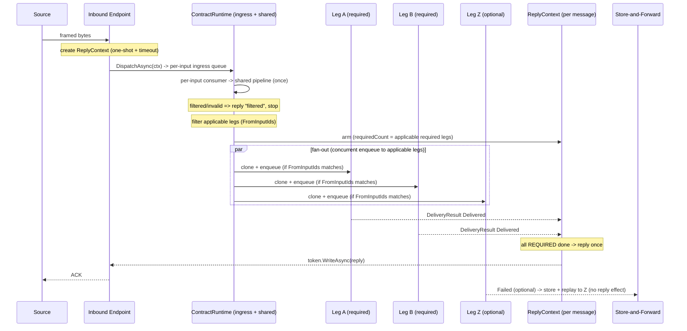

### 4.1 Message lifecycle (single‑message vs batched leg)
The lifecycle is identical up to the leg; the two cases differ only in **how the leg delivers**.

**Single‑message leg (TCP / HTTP / File):**
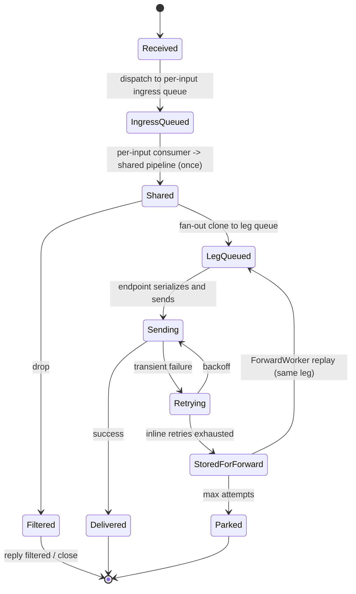

**Batched leg (CIM / S3):**
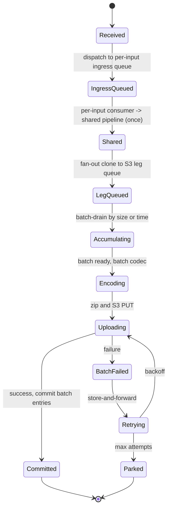

### 4.2 Envelope & clone lifetime (memory ownership)
Fan‑out creates **one `MessageContext` per leg**, but a clone is a **thin envelope**: `CloneForLeg` copies only the small scalar fields and **shares `Payload`, `ParsedView`, and `Headers` by reference** — no byte or dictionary copy (P1, F‑perf4). So a 3‑leg fan‑out is 1 original + 3 clone objects around **one** copy of the message bytes. A **single‑leg** fan‑out skips the clone entirely and reuses the original envelope in place (`SetLeg`).

Lifetime is **managed by the GC — nothing is freed by hand** (P10):
- A clone is reachable only while its **leg queue** holds it or its **consumer** is processing it. When the consumer loop advances to the next message, the clone becomes unreachable and is collected.
- The **shared `Payload`** is reclaimed only when the **last** referrer (the original *and* every clone) has been released — whichever leg finishes last frees the bytes. This is why sharing is safe: no leg can pull the bytes out from under another.
- **Ordering note:** the reply is settled by the `ReplyContext` independently of when the envelopes are collected; a settled reply does not keep clones alive.

The **failure path never pins RAM**: when an `AtLeastOnce` leg fails, it **persists the post‑pipeline bytes + header snapshot to the store‑and‑forward buffer** (`IForwardStore`, §3.9) and then releases the in‑memory clone. `ForwardWorker` later **rebuilds a fresh `MessageContext` from the stored row** to replay — so a message awaiting retry lives on disk, not in memory. (`AtMostOnce` legs don't persist, so their clones are simply collected.)

**Resources vs. memory (don't conflate):** the message envelope is plain managed memory, but the **source connection behind `IAckToken`** is owned by the inbound endpoint / connection pool — it is closed or returned when the reply is written or during drain (§5), **not** by the envelope. Object/buffer pooling (e.g. `ArrayPool<byte>` or pooling the envelopes themselves) is a **deferred** performance option behind the same shape (P10) — not required to be correct.

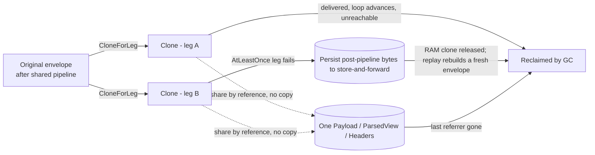

---

## 5. Concurrency Model

- **Threading:** all `async`/`await`; no manual threads. Per‑input ingress consumers and per‑leg consumers are long‑lived tasks.
- **Producer–Consumer everywhere:** producers = inbound endpoints (+ the `ForwardWorker`); each per‑input ingress queue feeds the shared pipeline; the per‑input consumer is a producer to the leg queues; leg consumers drive delivery.
- **Queues:** **one ingress queue per input comm point** (within its contract) + **one queue per output leg**. Every endpoint — input or output — owns its own queue. All bounded. Sizing per `Channel.Capacity`.
- **Overflow policy (per queue):** `Wait` (async backpressure, default), `Reject` (fast‑fail, e.g. HTTP 503), `SpillToDisk` (durable legs absorb bursts to journal). `DropOldest/Newest` not offered for clinical data.
- **Backpressure semantics:**
  - Per‑input ingress full → dispatch awaits → **only that source** slows. Other inputs' queues are unaffected (per‑input isolation).
  - Fan‑out enqueues to **applicable** legs **concurrently** and awaits all (`Task.WhenAll`). Legs whose `FromInputIds` excludes the message's source are skipped (no enqueue, no backpressure). A full **required** applicable leg (Wait) makes fan‑out await → that input's ingress fills → that source slows — this **couples that input to the contract** (intended when a critical output is down); sibling inputs are unaffected (their queues drain independently). A full **optional** leg (Reject/SpillToDisk) never blocks anything. **Single‑leg fast path:** the dominant 1‑input→1‑output shape skips the LINQ/`Task.WhenAll`/`AsTask` machinery and awaits the one leg's `ValueTask` directly (no per‑message list/array allocation) **and reuses the original envelope in place via `SetLeg` (no clone)** — a truly allocation‑free per‑message fan‑out for the high‑fidelity path. This is realized by a **precomputed per‑source `FanOutPlan`**: the applicable legs + required count for a source are a pure function of its (fixed) input id, so each source resolves **one plan at construction** (not per message), and the plan's *shape* (single‑leg vs multi‑leg) is chosen then — so the hot loop carries **no per‑message LINQ and no leg‑count branch**, just one `plan.DispatchAsync(ctx)` call.
  - So isolation is **per‑input on the ingress side** and **complete for optional legs** on the output side; a slow **required** leg couples the contract **by design** for the input that produced the message. Letting a required leg divert to its own durable store instead of backpressuring (so siblings keep flowing) is a **deferred per‑leg `OnFull` policy** — see Future Improvements (F13/F7).
- **Parallelism / ordering:** `DegreeOfParallelism` is set **independently** on each per‑input ingress queue and on each leg. **Ordering is not preserved when an input's DOP > 1, nor when a message is replayed from store‑and‑forward** (a replay re‑arrives after newer messages). For order‑sensitive flows use the **`Ordered` contract mode**: the relevant input's DOP = 1 (or partition‑by‑key end‑to‑end), each ordered leg DOP = 1, and **in‑order retry** (park‑and‑halt the key on failure rather than skipping ahead). The default (unordered) mode favors throughput. There is **no cross‑input and no cross‑leg ordering** in either mode.
- **Intra‑message parallelism (deferred):** a future `ParallelStage` (scatter‑gather, §3.6a) would run independent branches within a single message's pipeline concurrently and join before continuing — orthogonal to `DegreeOfParallelism` (which is cross‑message). **Not implemented today; the pipeline is linear.** Until then, a stage may still `Task.WhenAll(...)` its own internal I/O.
- **Cancellation:** one linked `CancellationToken` tree from host shutdown; observed by endpoints, ingress, legs, outbound sends. No `CancellationToken.None` on the hot path.
- **Graceful shutdown (deterministic):** (1) endpoints stop accepting; (2) all per‑input ingress queues `Complete()` + drain (bounded timeout); (3) each leg `Complete()` + drain; (4) durable legs commit/park, in‑memory legs flush to store‑and‑forward; (5) flush outbound batches, close pools; (6) dispose.

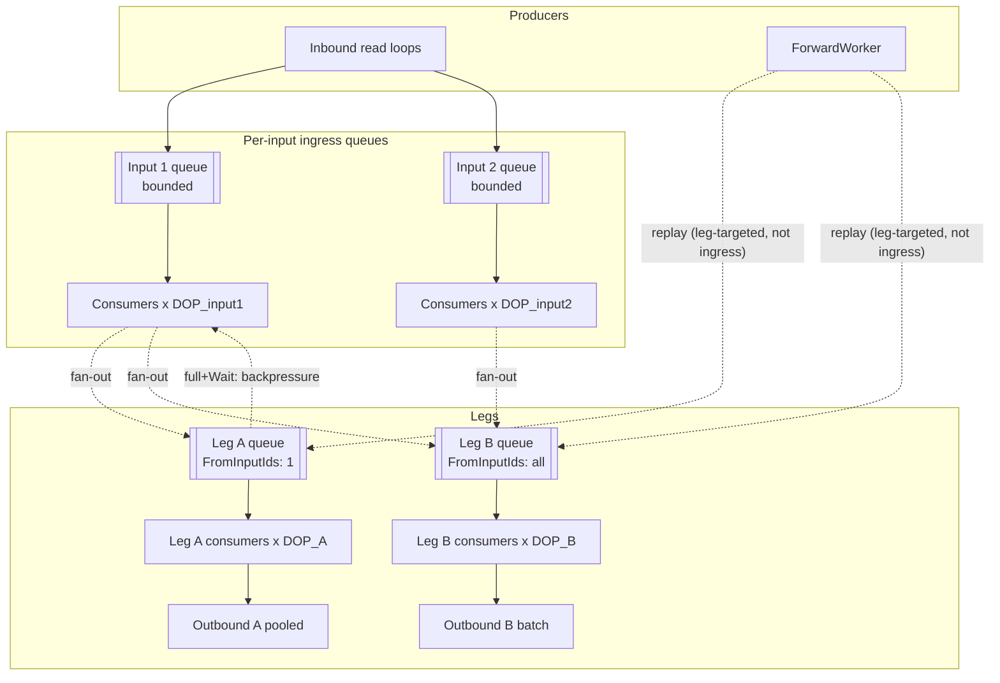

---

## 6. Acknowledgement & Response Model (dedicated)

The source expects **one** reply — usually an ack, sometimes a **response** (§6.1); M legs finish at different times. The per‑message **`ReplyContext`** (created at reception, INV‑6) coordinates it.

**Two configured ack modes (as today), set per contract via `{ IsEnabled, IsEnhanced }`:**
- **`IsEnabled = false`** — no ack (fire‑and‑forget); the `ReplyContext` still tracks outcomes for metrics/store‑and‑forward.
- **Normal / original ack** (`IsEnabled = true, IsEnhanced = false`) — a **generated** HL7 ACK ("AA") meaning *"received."* Sent as soon as the message is safely taken — i.e., on **durable receipt** (once required durable legs have journaled it; for at‑most‑once, on accept). It does **not** reflect the downstream result, so partial delivery is irrelevant to it.
- **Enhanced ack** (`IsEnabled = true, IsEnhanced = true`) — the ack **reflects the actual delivery outcome**: on success it **passes the destination comm point's own acknowledgement straight back to the source** (the positive ack bytes come **from the output comm point**, never engine‑generated); on a required‑leg failure it generates a negative ACK (AE/AR). Sent **after delivery**. **This holds for single‑ and multi‑output contracts alike — the positive ack is always taken from the output comm point.** (For a multi‑output contract all required legs must still succeed, below; the `ReplyContext` collects every required leg's result and, for the **Single** ack shape, relays the **first required leg by `OutputId`** — deterministic, not timing‑dependent. Combining several downstream acks into **one composite ack** is the **Batch** shape, a future refinement — see the batch bullet below.) This is the only mode where multi‑output partial success matters (below). A configurable **`TimeoutMs`** (default 30 s) bounds the wait: if a required leg hangs, the `ReplyContext` fires a **negative ACK on timeout** and releases the source, so a stuck leg never blocks it forever (`TimeoutMs ≤ 0` opts out of the timeout).

**Filtered messages (shared‑pipeline short‑circuit).** A message dropped by the pipeline (filter/dedup) reports `Filtered` to the `ReplyContext`. Whether the source is told is decided by **`ReplyOnFilter`** — a **developer default set on the catalog `Template`** (the developer who defines the filter pipeline best knows the intent), which an **FSE may override on the contract**. **`true`** sends an intentional‑**reject** ack carrying the filter reason (HL7 **`AR`** + reason — distinct from a delivery‑failure `AE`); **`false`** (the default when unset) is a **silent drop** (no reply, and the pending reply timer is cancelled), reproducing the legacy behavior. The reject *code* is the formatter's job (keyed on the `Filtered` outcome), so no HL7 specifics leak into the engine.

**Required vs optional legs:** only **required** legs gate the ack; optional legs are best‑effort (own store‑and‑forward entries) and never affect it. The **required count is per‑message**: at fan‑out, only legs whose `FromInputIds` matches the message's source (or whose `FromInputIds` is null/empty) are applicable; the `ReplyContext` is armed with the count of **applicable required legs** for *this* message. For **enhanced** ack over a multi‑output contract, the rule is fixed: **all applicable required legs must succeed** (else negative ACK) — there are no extra knobs to configure.

**What a leg outcome means for the ack** (a leg outcome is `Delivered` or `Failed`; whole‑message `Filtered` is a **shared‑pipeline** short‑circuit before fan‑out, not a leg outcome):
| Leg terminal outcome | Interpreted as | Effect (required leg) |
|---|---|---|
| `Delivered` | success | contributes to positive ACK |
| `Failed` (inline retries exhausted) | failure | negative ACK (enhanced); stored in store‑and‑forward |

**Partial delivery under fan‑out (enhanced ack, multi‑output only).** With **enhanced** ack, a message counts as delivered **only if every required leg succeeds** (all‑required). Example: a contract fans a message out to required legs **B** and **C**; **B** delivers and acks, but **C** does not. This is treated as an **overall failure** — we do **not** consider any ack received:
- The `ReplyContext` **withholds the positive ACK / sends a NACK**, so the source sees the message as *not* delivered and applies its own resend policy.
- The **failed** required leg (**C**) is stored in **store‑and‑forward** (tagged with its `OutputId`) and retried by the always‑on `ForwardWorker` (our normal failure management). Only the failed leg is re‑sent by us — the already‑succeeded leg (**B**) is **not** re‑sent, so we don't generate duplicates on B.
- Because a NACK may cause the *source* to resend the whole message (re‑delivering to B), downstream **idempotency/dedup** — or an upstream `DeduplicateStage` (keyed by a generic `IdempotencyKey`, e.g. HL7 `MSH‑10`) — protects B from duplicates. This is the accepted cost of synchronous all‑or‑nothing semantics.
- **If you need true all‑or‑nothing with no duplicate risk**, use **Normal** ack (ack on durable receipt) with `AtLeastOnce` required legs: the message is durably accepted once and acked immediately, and the engine (not the source) guarantees delivery to every required leg via per‑leg retry + store‑and‑forward — so a slow/failing C never triggers a source resend to B.

**Timing vs durability interaction:**
| Delivery guarantee | Ack mode | Behavior |
|---|---|---|
| AtMostOnce | Enhanced | ack after real delivery to required legs; required failure → negative ACK; no durable replay |
| AtLeastOnce | Normal | ack on durable receipt (journaled); **no negative ACK** — legs + store‑and‑forward guarantee eventual delivery; source freed early |
| AtLeastOnce | Enhanced | ack after first real delivery to required legs; still durable (retries continue) |

**Correlation:** the `IAckToken` (bound to the source connection) is shared by reference across all leg clones via the `ReplyContext`, so whichever required leg finishes last triggers the one reply to the correct source. The `ReplyContext` guards the reply with an `Interlocked` one‑shot (fires exactly once, even under concurrent leg completions) and a **timeout** (§6.1) that fires a negative/error reply if the required legs never complete.

**Ack shape is a config choice, realized by a formatter subclass (`IAckFormatter`).** This governs **generated** replies only — **Normal** acks, an enhanced **negative** ACK, and batch ack shapes; a positive **enhanced** ack is **relayed from the output comm point** and skips the formatter (see the enhanced‑ack bullet above). For generated replies, *how many* acks and *what envelope* is a formatter concern — chosen by the source's `Format` and the contract's `AckShape` (config, **not** auto‑detected), independent of the when/what strategy:
- **Single** (default, today) — one `ACK` with a single `MSA`. `Hl7SingleAckFormatter` (= `HL7AckGenerator`).
- **Batch** — for an HL7 **batch** (`BHS`…`BTS`) source configured with `AckShape = Batch`, the reply is **one batch ACK** wrapping one `MSH`/`MSA`[/`ERR`] per message. The inbound endpoint groups the de‑batched messages under one *ack group* (a generic group id + expected count); the collected per‑message outcomes feed a drop‑in `Hl7BatchAckFormatter` once the group completes. The **same** batch formatter also serves the multi‑output enhanced case (one unit per required output leg). Adding it changes **nothing** in the engine/strategy/token/`ReplyContext` (OCP). **Not yet implemented — `AckShape.Batch` is rejected at config validation until `Hl7BatchAckFormatter` lands (see docs/vaibhavToDoList.md).** Example:
```text
BHS|^~\&|RECV_APP|RECV_FAC|SEND_APP|SEND_FAC|202607161439||||BATCH_ACK_999
MSH|^~\&|...|ACK^R01^ACK|ACK_MSG_001|P|2.4
MSA|AA|SRC001|Message 1 processed successfully
MSH|^~\&|...|ACK^R01^ACK|ACK_MSG_002|P|2.4
MSA|AE|SRC002|Error: Patient ID not found
ERR||PID^1^3^1^1||E|100^Segment sequence error^HL70357
MSH|^~\&|...|ACK^R01^ACK|ACK_MSG_003|P|2.4
MSA|AA|SRC003|Message 3 processed successfully
BTS|3
```

**The same applies to every message type — `IAckFormatter` is keyed by a (`Format` × `Shape`) pair.** Each type brings its own ack family and shapes: HL7 → single `ACK`/`MSA` or batch `BHS`…`BTS`; **FHIR → single `OperationOutcome` or batch a response `Bundle`**; XML/other likewise. A source **always receives an ack in its own type** (a FHIR source → FHIR ack, an HL7 source → HL7 ack) — this is **not** ack‑type conversion (INV‑4). Supporting a new (type, shape) is registering one more `IAckFormatter` for that pair; the engine, strategy, token, and `ReplyContext` are unchanged (OCP). HL7 single is the only pair wired today.

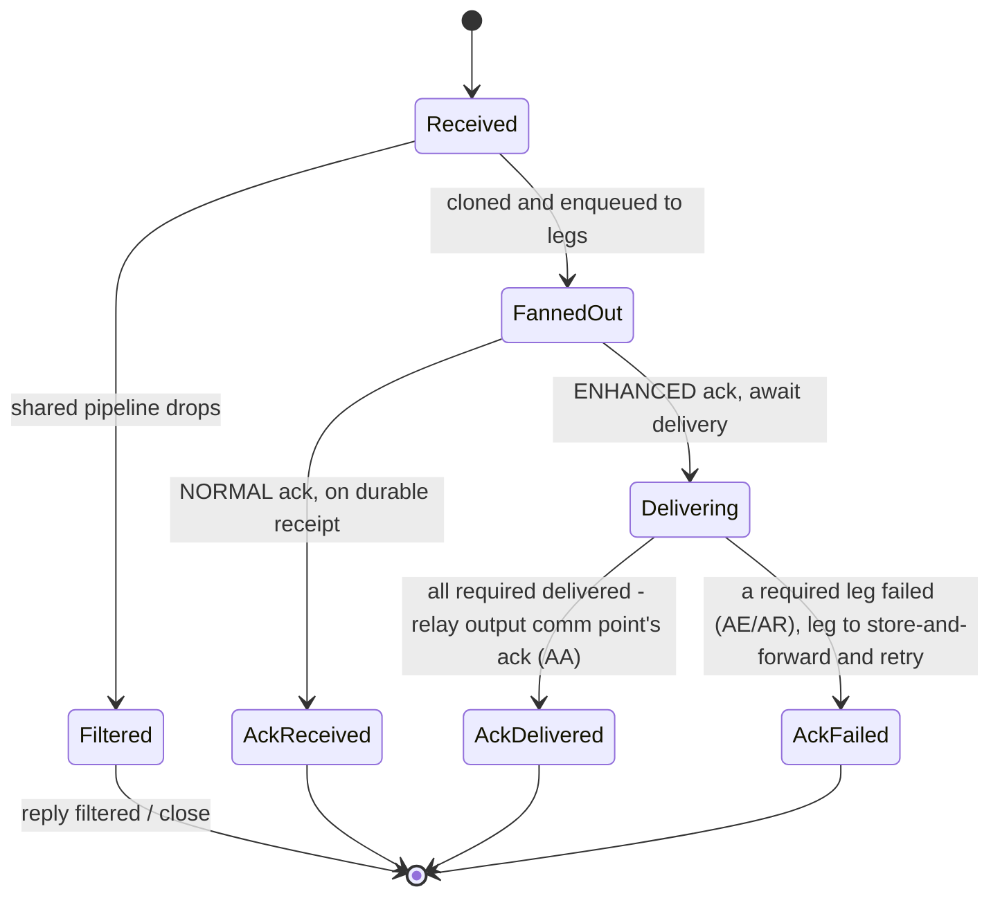

**Reply decision flow — all reply modes in one view.** The state diagram above covers the ack modes; the flow below adds the **disabled**, **response**, and **timeout** branches so every case the one‑shot `ReplyContext` can take is visible together. Only **required** legs gate the reply; optional legs never do.

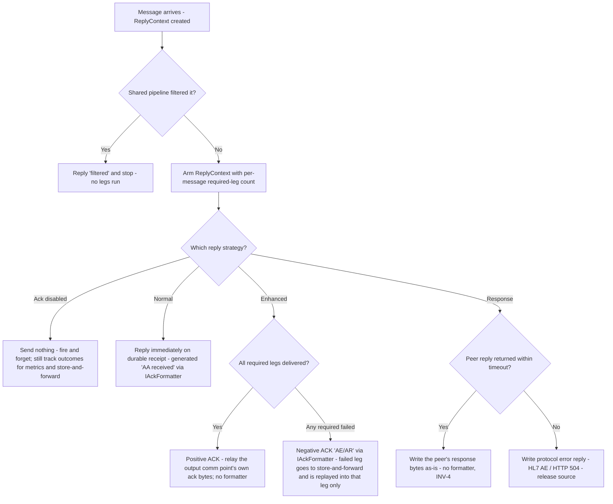

### 6.1 Request‑Reply (a response instead of an ack)

Some sources send a **request** and expect the **output peer's response** back — not an ack (e.g., an HL7 query `QBP^Q11` → `RSP^K11`, an HTTP request → response body, a FHIR read → resource). This rides the **same return path** as ack — the `IAckToken` write‑back coordinated by the one‑shot `ReplyContext` — so it is a **third reply mode**, not a parallel synchronous engine (**Request‑Reply / Return‑Address / Correlation‑Identifier**, EIP).

**Shape:**
- **One designated responder leg** (`Response.FromOutputId`) — the only leg whose reply goes back to the source. Other legs (e.g., an S3 archive) run fire‑and‑forget and never gate the response.
- **Send‑and‑receive** — the responder's outbound endpoint captures the peer's reply on `DeliveryResult.ResponsePayload` (§3.7); the leg reports its outcome **carrying that payload**.
- **The `ReplyContext` fires the response** — its existing one‑shot invokes a plug‑in **`ResponseReplyStrategy`** (a registered `IAckStrategy`) that writes the captured payload via the token *instead of* generating an ACK. The reply is returned **as‑is** (pass‑through) in the source's own type; a return‑path transform is a future extension, not a config knob today.
- **Ack and Response are mutually exclusive per source** — a contract either acks or responds (validation enforces at most one enabled).

**Forward is durable/retried; the return address is ephemeral.** These two halves are independent — exactly the requirement:
- **Forward (input → output)** follows **normal per‑leg failure management**: the responder leg may be `AtLeastOnce` and is **retried on failure** (inline retry → store‑and‑forward → `ForwardWorker`), like any other leg. Getting the request to the output is guaranteed when the contract asks for it.
- **Backward (response → source)** is **best‑effort / ephemeral**: written back only while the source is **still waiting within the timeout**. If the source has already timed out or disconnected — or the forward leg is replayed from store‑and‑forward minutes later, when the connection is long gone — the reply is **dropped and logged, never persisted or replayed** (a synchronous return address cannot be resurrected). This is by design and acceptable.

**Timeout (mandatory).** The source connection is held (it occupies an inbound admission slot), so `Response.TimeoutMs` bounds the wait. On timeout the strategy writes a protocol‑appropriate **error reply** (HL7 NACK `AE` / HTTP `504` / FHIR error `OperationOutcome`), the token's one‑shot closes, and the source is released; any later reply finds a closed token → discarded. Size inbound admission concurrency for the expected number of concurrent outstanding requests.

**Correlation.** The `IAckToken` (bound to the source connection, shared by reference via the `ReplyContext`) correlates reply → request for the common single‑connection case — no global correlation map (P1). Transports that multiplex many outstanding replies over one shared outbound connection keep a pending‑map **inside the send‑receive endpoint** (encapsulated, not engine state).

**Scope today:** exactly **one** responder leg; the reply is returned **in the source's own type** (pass‑through). Cross‑type response conversion (e.g., a FHIR reply → HL7 `RSP`) is a future return‑path stage, consistent with the ack stance; multiple responders (a scatter‑gather of responses) is a future extension.

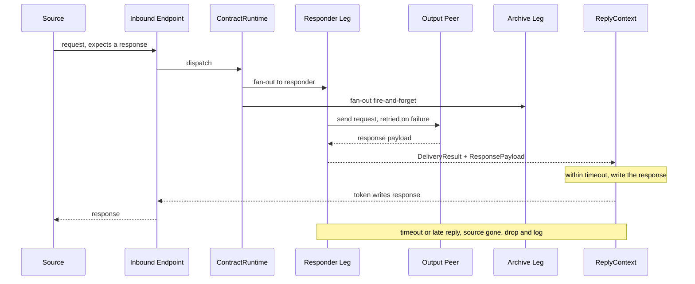

---

## 7. High Fidelity as Policies (per leg)

"High Fidelity" is **not** a mode. It decomposes into orthogonal **per‑leg** policies:
- **Delivery guarantee** → the leg's `IMessageChannel` (`DurableChannel` = AtLeastOnce; `BoundedInMemoryChannel` = AtMostOnce).
- **Batching** → a `BatchingOutboundEndpoint` decorator on that leg (size/time flush), available to any batch‑capable output.
- **Acknowledgement** → the contract's Normal/Enhanced ack (`{ IsEnabled, IsEnhanced }`) over required legs.

So a single contract can have one leg **durable + batched + required** (e.g., CIM/S3) and another **at‑most‑once + synchronous + required** (e.g., TCP to the EHR) and a third **optional** (file archive) — all coexisting, with acknowledgement composed over the required legs. The existing `S3BatchProcessor` is wrapped as the batch codec of a `CimS3OutboundEndpoint`; zero HF‑specific code in the engine.

---

## 8. Configuration Architecture

**Rule (P8):** config declares topology + limits; code defines behavior. Config models are pure DTOs (no delegates). **Two audiences, two files.** *Developers* own the **catalog** (`catalogData.json`) — the "plug‑and‑play code" building blocks: named **`Pipelines`** (stages), **`Codecs`** (encoders), **`Formats`** (a per‑leg encoding bundle = message codec + optional batch codec), and **`Templates`** (a contract blueprint = a shared pipeline + a default per‑leg format). *FSE/field engineers* own the **contracts** (`contractData.json`) and pick a developer **`Template`** by name — they never choose raw codecs, assemble stages, or hand‑pick encodings. The FSE sets only **message‑level/operational** knobs: the reply mode (`Acknowledgement` XOR `Response`), `Retry`, `DeliveryGuarantee`, per‑input/per‑output `Channel`, and batch **triggers** (`Batching { Enabled, MaxCount, MaxLatencyMs }`). Every catalog‑supplied value is **optionally overridable** on the contract (a per‑leg `Format`, or an inline `Encoding` escape hatch), so the model stays powerful without forcing FSEs to learn developer concerns.

**Delivery guarantee (per output):**
- `AtMostOnce` — in‑memory bounded channel (`BoundedInMemoryChannel`); lowest overhead; an in‑flight message can be lost on crash. Fine when the source resends on a missing ack (e.g., a synchronous TCP relay).
- `AtLeastOnce` — durable journal (`DurableChannel`): persisted on enqueue, committed only after successful delivery; survives restart (never lost) at the cost of possible duplicates (handled by a `DeduplicateStage` / downstream idempotency). Use for guaranteed‑delivery sinks (CIM/S3).

**Message format & ack shape (single‑format contracts).** Each **input comm point** declares one `Format` (INV‑1: one input → one format; `hl7v2` today, `fhir`/`xml` later) that selects the parser, stages, and source `IAckFormatter`. **All inputs of a contract must share the same `Format`** (INV‑2) — validated at load; two formats ⇒ two contracts. A contract's `Acknowledgement` sets `AckShape` (`Single` default | `Batch`) — a **config choice**, not auto‑detected. Symmetrically each **output leg's wire encoding** comes from the contract's **`Template`** (its default `Format`) — a **developer** decision, not an FSE‑authored field; a leg may optionally override it with a different catalog `Format`, or (legacy escape hatch) an inline `Encoding` codec name. Per **INV‑4** the reply is never converted; per **INV‑5** the pipeline parses once and codecs serialize per leg.

**Request‑reply (a response instead of an ack):** a contract may declare a `Response` block *instead of* an enabled `Acknowledgement` (the two are mutually exclusive). `Response { IsEnabled, FromOutputId, TimeoutMs }` names the single **responder** output whose peer reply is returned to the source and a mandatory `TimeoutMs`. The **forward** delivery to that output still obeys its own `Retry`/`DeliveryGuarantee` — retried on failure like any leg — while only the **return** of the reply is time‑bounded and ephemeral; the reply goes back as‑is in the source's own type (§6.1).

**Contract** = a **`Template`** name (the developer blueprint supplying the shared **pipeline** and the default per‑leg **format**/encoding), `Inputs` (one entry per input comm point, each with its own `Channel` — symmetric with outputs), `Acknowledgement { IsEnabled, IsEnhanced }` **or** a `Response` block (the FSE‑owned reply mode, mutually exclusive), an optional **`ReplyOnFilter`** override (inherits the catalog `Template`'s developer default — `true` = a pipeline‑filtered message gets an intentional‑reject ack, `false` = silent drop), and an **`Outputs`** list. Each **input** carries its own `InputId` and `Channel { Capacity, DegreeOfParallelism, Ordered, OverflowPolicy }` (per‑input isolation). Each **output** carries its **FSE‑owned** `Required`, `DeliveryGuarantee`, `Channel { Capacity, DegreeOfParallelism, Ordered, OverflowPolicy }`, `Retry`, batch **triggers** (`Batching { Enabled, MaxCount, MaxLatencyMs }`), and an optional **`FromInputIds`** (the subset of this contract's inputs that route to this output; null/empty = all inputs — default); its **wire encoding and batch codec are inherited** from the template's `Format`, with an optional per‑leg `Format` override (developer‑named) or an inline `Encoding` (legacy escape hatch). A **template‑less** contract may instead name a `Pipeline` and inline `Encoding` per output directly (manual mode). **There is no per‑output pipeline** (YAGNI) — output formatting is the endpoint's codec, chosen by the resolved `Encoding` (per message) or the resolved batch codec (per batch); all message processing already happened once in the shared pipeline.

**Catalog (developer‑owned, e.g. `catalogData.json`):** the single place developers define reusable, named building blocks that FSEs reference by name — **`Pipelines`**, **`Codecs`**, **`Formats`**, and **`Templates`**. Each layer references the previous by name (`Templates`→`Pipelines`+`Formats`; `Formats`→`Codecs`).
- **`Pipelines`** — named **shared** pipelines (the contract's one pipeline, run once before fan‑out). Each maps to an ordered **list of stage names**. Processing **only** — no `deliver` stage (delivery is the leg's endpoint) and no encoding stage (encoding is a codec).
- **`Codecs`** — named codec bindings, each pairing a **registered codec `Type`** with its **parameters**. **Message codecs** (`IMessageCodec`, one message → bytes) and **batch codecs** (`IBatchCodec`, N → 1 artifact) are referenced from a `Formats` entry (`Codec`/`BatchCodec`) — or, as a legacy escape hatch, directly by an output's `Encoding`/`Batching.Codec`. Naming them here (rather than hardcoding) lets one codec type be reused with different params (e.g., two Avro configs with different schemas) and swapped in one place.
- **`Formats`** — named **per‑output‑leg encoding bundles**: a message `Codec` plus an optional `BatchCodec` (both names of `Codecs` entries). The developer's "how a leg renders bytes" unit — an FSE output inherits it from the template or names one to override a single leg. (The name is distinct from an *input comm point's* `Format` tag, which selects the parser/ack; this `Formats` catalog governs *output* rendering.)
- **`Templates`** — named **contract blueprints** an FSE picks by name: a shared **`Pipeline`** (optional; omit = no stages), a default per‑leg **`Format`**, and the filter‑reply default **`ReplyOnFilter`** (reject vs silent‑drop for pipeline‑filtered messages — a developer decision tied to the filter, overridable by the FSE). Message‑level QoS (ack mode, retry, delivery guarantee, channel, batch triggers) stays FSE‑owned on the contract.
```jsonc
// catalogData.json  (developers own this; FSEs only reference Template names)
{
  "Pipelines": {                                     // SHARED pipelines: processing only, no deliver/encode
    "adt-standard":   [ "validate", "hl7-filter", "pid-enricher" ],
    "query-validate": [ "validate", "hl7-filter" ]
  },
  "Codecs": {                                        // name -> { registered Type + params }; referenced from a Formats entry
    // message codecs (IMessageCodec): one message -> wire bytes   (referenced by Formats[].Codec)
    "hl7v2":     { "Type": "Hl7v2Codec", "Charset": "UTF-8" },
    "fhir-json": { "Type": "FhirJsonCodec", "FhirVersion": "R4" },
    "raw":       { "Type": "RawCodec" },
    // batch codecs (IBatchCodec): N messages -> 1 artifact         (referenced by Formats[].BatchCodec)
    "avro-zip":  { "Type": "AvroZipBatchCodec", "SchemaPath": "PayloadSchema.avsc", "Compression": "deflate" },
    "ndjson":    { "Type": "NdJsonBatchCodec" }
  },
  "Formats": {                                       // per-leg encoding bundle: { Codec (+ optional BatchCodec) }; referenced by Template.Format / Output.Format
    "hl7-standard":    { "Codec": "hl7v2", "BatchCodec": "avro-zip" },
    "fhir":            { "Codec": "fhir-json" },
    "raw-passthrough": { "Codec": "raw" }
  },
  "Templates": {                                     // contract blueprint an FSE picks by name: shared Pipeline + default Format
    "adt":       { "Pipeline": "adt-standard",   "Format": "hl7-standard" },
    "lab-query": { "Pipeline": "query-validate", "Format": "hl7-standard" }
  }
}
```

**Validation (fail‑fast):** referential integrity (every input/output resolves to a comm point of the right mode), unique ids, ≥1 input per contract, ≥1 output per contract, ≥1 required output when acknowledgement is enabled, **all inputs of a contract share one `Format`** (INV‑2), **the contract's `Template` (when present) resolves to a catalog `Templates` entry, catalog `Templates` reference valid `Pipelines`/`Formats`, and catalog `Formats` reference valid `Codecs`**, **the resolved `Pipeline` resolves to a catalog `Pipelines` entry**, catalog stage names resolve to registered stages, **each output's optional `Format` resolves to a catalog `Formats` entry, and every output's resolved `Encoding` resolves to a catalog `Codecs` entry of message‑codec type and its resolved batch codec to one of batch‑codec type** (and each entry's `Type` resolves to a registered codec impl), **each output's `Encoding` is compatible with the contract's `Format`** (same family, or a registered known mapping like HL7→Avro; cross‑family conversion is rejected — INV‑4), per‑input and per‑output capacity/DOP > 0, **at most one enabled reply mode per contract (ack XOR response) and `Response.FromOutputId` resolves to one of the contract's outputs**, **every `FromInputIds` entry resolves to one of the contract's `Inputs`**, **every input has at least one applicable required output** (an input with zero applicable required legs and ack enabled is a validation error). One serializer (`System.Text.Json`).

**Config safety (stringly‑typed keys).** All `Type`/name references (stages, codecs, endpoints, formatters) are validated against the **Component Registry** at startup (fail‑fast); a generated **manifest of valid names** plus a **JSON schema** give editor‑time checking; code registers types via `nameof`/typed constants so renames are caught by the compiler.

**Parallel stages (deferred):** concurrent, in‑pipeline `parallel` composites are a **future** feature (see §3.6a). Today a catalog pipeline is a flat, ordered list of stage names; when `ParallelStage` lands, a pipeline entry will be allowed to nest a `parallel` composite with `Branches`, built recursively by the `PipelineBuilder` and validated the same way. (Composition lives in the catalog, not in the contract.)

**Backward‑compatible shorthand:** a flat `InputIds: [1, 2]` array (without per‑input `Channel`) compiles to `Inputs` entries with default `Channel` settings; a single `OutputId` compiles to a one‑element `Outputs` list (one required leg); an omitted/null shared `Pipeline` means **no processing stages** — the message is delivered as received (the leg's endpoint still encodes + sends). A contract may omit `Template` entirely and wire developer concerns inline (a `Pipeline` name + per‑output `Encoding`) — **manual mode**. Before compilation the **`ContractTemplateResolver`** flattens any `Template`/`Format` references into concrete per‑leg `Pipeline`/`Encoding`/batch‑codec values, so the compiler and validators always see fully‑resolved contracts.

**Example `contractData.json` (FSE‑owned) — pick a `Template` by name; the FSE owns only message‑level/operational settings:**
```jsonc
{
  "Contracts": [
    {
      "Name": "adt-fanout",
      "Template": "adt",                                          // developer blueprint: pipeline "adt-standard" + default format "hl7-standard"
      "Inputs": [                                                   // one queue per input (symmetric with Outputs)
        {
          "InputId": 1,                                             // TCP source — high throughput
          "Channel": { "Capacity": 2048, "DegreeOfParallelism": 4, "Ordered": false, "OverflowPolicy": "Wait" }
        },
        {
          "InputId": 2,                                             // HTTP source — lower volume, fast-fail on overflow
          "Channel": { "Capacity": 512, "DegreeOfParallelism": 1, "Ordered": true, "OverflowPolicy": "Reject" }
        }
      ],
      "Acknowledgement": { "IsEnabled": true, "IsEnhanced": true, "AckShape": "Single" },  // FSE-owned reply mode (Single | Batch)

      "Outputs": [
        {
          "OutputId": 20, "Required": true,                       // TCP to EHR — only Input 1 routes here
          "FromInputIds": [ 1 ],                                   // per-leg input filter: only Input 1
          "DeliveryGuarantee": "AtMostOnce",                       // encoding inherited from Template -> Format "hl7-standard" (hl7v2)
          "Channel": { "Capacity": 1024, "DegreeOfParallelism": 1, "Ordered": true, "OverflowPolicy": "Wait" },
          "Retry": { "MaxAttempts": 3, "BackoffSeconds": 2, "Backoff": "Exponential" }
        },
        {
          "OutputId": 2, "Required": true,                        // CIM/S3 (durable, batched) — both inputs route here (omitted = all)
          "DeliveryGuarantee": "AtLeastOnce",
          "Batching": { "Enabled": true, "MaxCount": 500, "MaxLatencyMs": 10000 },  // FSE owns triggers; batch codec "avro-zip" inherited from the Format
          "Channel": { "Capacity": 8192, "DegreeOfParallelism": 4, "Ordered": false, "OverflowPolicy": "SpillToDisk" }
        },
        {
          "OutputId": 14, "Required": false,                      // File archive (best-effort) — only Input 2
          "FromInputIds": [ 2 ],                                   // per-leg input filter: only Input 2
          "Format": "raw-passthrough",                            // per-leg OVERRIDE: a different catalog Format (raw codec)
          "DeliveryGuarantee": "AtMostOnce",
          "Channel": { "Capacity": 512, "OverflowPolicy": "Reject" }
        }
      ]
    },
    {
      "Name": "lab-query",                                        // REQUEST-REPLY: source wants the peer's response, not an ack
      "Template": "lab-query",                                    // pipeline "query-validate" + default format "hl7-standard"
      "Inputs": [
        { "InputId": 5, "Channel": { "Capacity": 256, "DegreeOfParallelism": 4, "Ordered": false, "OverflowPolicy": "Wait" } }
      ],
      "Acknowledgement": { "IsEnabled": false },                  // ack off; response is used instead (mutually exclusive)
      "Response": { "IsEnabled": true, "FromOutputId": 30, "TimeoutMs": 30000 },

      "Outputs": [
        {
          "OutputId": 30, "Required": true,                       // query peer: send request, receive RSP -> returned to source
          "DeliveryGuarantee": "AtLeastOnce",                     // encoding inherited from Template; FORWARD retried/guaranteed, the RETURN reply is ephemeral
          "Channel": { "Capacity": 256, "DegreeOfParallelism": 4, "Ordered": false, "OverflowPolicy": "Wait" },
          "Retry": { "MaxAttempts": 3, "BackoffSeconds": 2, "Backoff": "Exponential" }
        },
        {
          "OutputId": 2, "Required": false,                       // optional S3 archive of the query (fire-and-forget)
          "DeliveryGuarantee": "AtLeastOnce",
          "Batching": { "Enabled": true, "MaxCount": 500, "MaxLatencyMs": 10000 },  // batch codec inherited from the Format
          "Channel": { "Capacity": 8192, "DegreeOfParallelism": 4, "Ordered": false, "OverflowPolicy": "SpillToDisk" }
        }
      ]
    }
  ]
}
```

---

## 9. Extension Model

Add a type, register it, reference it in config — never edit the engine.
- **New protocol** → implement `IInboundEndpoint`/`IOutboundEndpoint` + factory; reference by `type`. ContractRuntime/legs untouched.
- **New processing step** → implement `IMessageStage`, register by name; add it to the shared `Pipeline`.
- **New output on a contract** → add an entry to `Outputs` (config only) — a new leg is compiled.
- **New output wire format / encoding** → implement `IMessageCodec` (per message) or `IBatchCodec` (per batch), register the type, add a named entry to the catalog's `Codecs` (type + params), bundle it into a `Formats` entry, and expose it through a `Templates` entry (or reference the `Format` directly on an output). FSE contracts pick it by **template name**. No engine change.
- **New reusable contract blueprint** → add a `Formats` and/or `Templates` entry to the catalog (config only) that composes existing pipelines + codecs; FSEs reference it by name. No engine change.
- **New ack timing / retry / delivery‑guarantee / routing policy** → implement the corresponding strategy/channel/resolver and register by name.
- **New ack format/shape** → implement `IAckFormatter` and register it under its `(Format, Shape)` key (e.g. `(hl7v2, Batch)`, `(fhir, Single)`); it's selected automatically by the source comm point's `Format` + the contract's `AckShape`. No engine change.
- **New message type (HL7 / FHIR / XML / …)** → set `Format` on the input comm point and register that type's **parser + stages + `IAckFormatter`(s)**; the engine stays payload‑neutral (INV‑1/INV‑4).
- **Request‑reply on a contract** → add a `Response` block naming one responder output; its outbound endpoint captures the peer reply (`DeliveryResult.ResponsePayload`) and a registered `ResponseReplyStrategy` writes it back over the token — no engine change (§6.1).
- **Plugins** → factory/registry indirection lets a `PluginLoader` register external stages/endpoints identically; build only when needed (P10).

---

> **Greenfield rewrite.** This is a **new repository**, not an in‑place refactor. We reproduce *what the legacy achieved* (multi‑protocol routing, store‑and‑forward, HL7 ACK, CIM/S3, web management) using the boundaries in this document. Legacy code is ported **behind the new interfaces** only where it already embodies best practice (`S3BatchProcessor` → `AvroZipBatchCodec`; DPAPI `DataDecipher`; the Postgres failure store).

**Root namespace / product identity.** Everything stays under `Philips.IBE.IBEAgent.*` — it matches the installed Windows‑service identities (`Philips.IBE.Agent` / `Philips.IBE.Forward` / `Philips.IBE.Web`) and the existing installer paths, so the field install is unaffected. The store‑and‑forward host is renamed to **`Philips.IBE.IBEAgent.ForwardService`** (folder = assembly = exe), dropping the misleading legacy `CimS3` prefix — the subsystem forwards **all** output types (TCP/HTTP/File/S3), not just S3. Its **deployed identities are unchanged** (exe `Philips.IBE.IBEAgent.ForwardService.exe`, publish dir `ForwardService`, service `Philips.IBE.Forward`), so `ServiceInstaller.ps1` and the field install are unaffected; only the previously‑mismatched project folder is corrected to match the assembly.

**Physical layout — flat by default, grouped only where a set proliferates:**

Two products live under `src/`: the **agent** (`Philips.IBE.IBEAgent/` umbrella) and the **Web** management service (`Philips.IBE.Service.WebAgent/` — config + monitoring only, optional install). Inside the agent umbrella the spine (`Abstractions`, `Core`) and the fixed infra set (`Configuration`, `Persistence`, `Security`, `Telemetry`) sit **flat**; only the sets that keep growing (`formats/`, `endpoints/`) and the deployables (`hosts/`) are **grouped**.

```
IBE_IBEAgent/                                          # repo root
  IBEAgent.slnx                                        # one solution; solution-folders mirror this tree (optional WebAgent.slnx for the web team)
  Directory.Build.props  Directory.Packages.props  global.json  .editorconfig  NuGet.config
  build/     build.ps1 (+ build.bat parity) · Installation Script/ (ServiceInstaller, Certificate/Password) · HA/
  config/    appsettings.json · catalogData.json · communicationData.json · contractData.json   (shared by Agent + Web)
  docs/      architecture/target-architecture-v3.md · adr/

  src/
    Philips.IBE.Service.WebAgent/                      # SEPARATE product: config + monitoring only; optional install
      Philips.IBE.Service.WebAgent.Server/             # ASP.NET Core API → publish/Web (+ wwwroot); refs Configuration (+ Abstractions)
      philips.ibe.service.webagent.client/             # Angular SPA
      Philips.IBE.Service.WebAgent.Server.UnitTest/

    Philips.IBE.IBEAgent/                              # the agent product — an umbrella FOLDER, not a project
      Philips.IBE.IBEAgent.Abstractions/               # MessageContext, DeliveryResult, enums + ALL cross-layer contract INTERFACES (A3):
                                                       #   IAckToken, IReplyContext, IMessageDispatcher, IRouteResolver, IContractRuntime, IMessageChannel,
                                                       #   IMessagePipeline/IMessageStage, IInbound/OutboundEndpoint, IMessageCodec/IBatchCodec,
                                                       #   IAckStrategy, IAckFormatter, IForwardStore — no deps
      Philips.IBE.IBEAgent.Core/                       # Dispatcher, Router, ContractRuntime, DeliveryLeg, ReplyContext (impl of IReplyContext, A2), pipeline engine,
                                                       #   ContractCompiler, PipelineBuilder, ComponentRegistry, ForwardWorker, channel base
      Philips.IBE.IBEAgent.Configuration/              # PURE config DTOs + validation + JSON schema — shared with WebAgent
      Philips.IBE.IBEAgent.Persistence/                # DurableChannel + IForwardStore IMPLEMENTATIONS (journal; store-and-forward: Pending|Parked) — shared with ForwardService (A3: the interfaces themselves live in Abstractions)
      Philips.IBE.IBEAgent.Security/                   # DPAPI DataDecipher, certificate helpers
      Philips.IBE.IBEAgent.Telemetry/                  # OTel meters, queue-depth gauges

      formats/                                         # message-Format plug-ins (this set grows → grouped)
        Philips.IBE.IBEAgent.Formats.Hl7/              # hl7v2: parser, Hl7v2Codec, Hl7SingleAckFormatter, HL7 filter, MSH-10 extractor
        # (future) Philips.IBE.IBEAgent.Formats.Fhir/  ·  Philips.IBE.IBEAgent.Formats.Hl7.Avro/

      endpoints/                                       # transport plug-ins (this set grows → grouped)
        Philips.IBE.IBEAgent.Endpoints.Tcp/            # MLLP in/out + pooled connection
        Philips.IBE.IBEAgent.Endpoints.Http/           # HTTP/WebSocket in/out
        Philips.IBE.IBEAgent.Endpoints.File/           # File in (poll)/out (write) + retention
        Philips.IBE.IBEAgent.Endpoints.CimS3/          # S3 batch out (AvroZip codec wraps legacy S3BatchProcessor)

      hosts/                                           # the deployables (Windows services)
        Philips.IBE.IBEAgent.Service/                  # MAIN → Philips.IBE.IBEAgent.Service.exe → publish/IBEAgent → svc Philips.IBE.Agent
        Philips.IBE.IBEAgent.ForwardService/           # store-and-forward → Philips.IBE.IBEAgent.ForwardService.exe → publish/ForwardService → svc Philips.IBE.Forward

  testkit/
    Philips.IBE.IBEAgent.TestKit/                      # FakeInbound/OutboundEndpoint, FakeAckToken, FakeMessageCodec, builders
  tests/
    Philips.IBE.IBEAgent.Core.UnitTests · *.Configuration.UnitTests · *.Formats.Hl7.UnitTests · *.Persistence.IntegrationTests · *.Host.IntegrationTests
```

**Why `hosts/`, not the umbrella itself:** `Philips.IBE.IBEAgent/` is a pure organizing folder; the runnable main service is the project `hosts/Philips.IBE.IBEAgent.Service` (folder = assembly = `Philips.IBE.IBEAgent.Service.exe`, matching the installer). Keeping both deployables in `hosts/` avoids the legacy `…/Philips.IBE.IBEAgent/Philips.IBE.IBEAgent/` same‑name nesting and puts every runnable in one obvious place. `WebAgent` references `Configuration` across the two `src/` subtrees by **project reference** — physical folder location is irrelevant to .NET references.

**Dependency direction (strictly acyclic, inward to `Abstractions`):**
```
Abstractions            ←  Configuration  ←  Core
Abstractions            ←  Security, Telemetry
Abstractions (+Security)←  Persistence
Abstractions (+Core)    ←  Formats.*, Endpoints.*
Host (Agent)            →  Core, Configuration, Persistence, Telemetry, Security, Formats.*, Endpoints.*   (composition root)
ForwardService          →  Persistence, Core, Endpoints.*, Formats.*, Configuration, Security, Telemetry
WebAgent.Server         →  Configuration (+ Abstractions);  optional Persistence read-model + Telemetry
```
`Core` never references `Endpoints.*`/`Formats.*` — they plug in through `Abstractions` + the Component Registry (DI). `Configuration` is a **pure DTO + validation** library with **no `Core` dependency**, so the Web service loads and validates the *same* config files without dragging in the engine (single source of config truth).

**Interface‑placement rule (A3) — the single rule that keeps the graph acyclic:** *every cross‑layer contract interface is declared in `Abstractions`*; where this document names an interface beside another library it means that library owns the **implementation**, not the type. Concretely `IAckToken`, `IReplyContext`, `IMessageChannel`, `IMessagePipeline`/`IMessageStage`, `IMessageCodec`/`IBatchCodec`, `IInbound/OutboundEndpoint`, `IRouteResolver`, `IContractRuntime`, `IMessageDispatcher`, `IAckStrategy`, `IAckFormatter`, and `IForwardStore` all live in `Abstractions`; the implementations live in `Core` (`ReplyContext`, `BoundedInMemoryChannel`, `Dispatcher`, `SourceBasedRouter`, `ContractRuntime`, `DeliveryLeg`…), `Persistence` (`DurableChannel`, the Postgres `IForwardStore`), `Formats.*` (codecs/formatters/stages), and `Endpoints.*` (transports). This is precisely what lets `MessageContext` (in `Abstractions`) reference `IReplyContext` while the concrete `ReplyContext` sits in `Core` (A2) and lets `DeliveryLeg` (in `Core`) depend on `IForwardStore` without `Core` referencing `Persistence`.

**Build / publish → field-install mapping (must stay compliant with `ServiceInstaller.ps1`):**

| Host project | Assembly / exe | `publish/` folder | Windows service |
|---|---|---|---|
| `src/Philips.IBE.IBEAgent/hosts/Philips.IBE.IBEAgent.Service` | `Philips.IBE.IBEAgent.Service.exe` | `publish/IBEAgent` | `Philips.IBE.Agent` |
| `src/Philips.IBE.IBEAgent/hosts/Philips.IBE.IBEAgent.ForwardService` | `Philips.IBE.IBEAgent.ForwardService.exe` | `publish/ForwardService` | `Philips.IBE.Forward` |
| `src/Philips.IBE.Service.WebAgent/Philips.IBE.Service.WebAgent.Server` | `Philips.IBE.Service.WebAgent.Server.exe` | `publish/Web` (+ `wwwroot`) | `Philips.IBE.Web` |

The build also copies `config/` + the `Installation Script/` PS1s + `HA/` into `publish/` exactly as today, so the existing installer keeps working unchanged. Auxiliary CIM/cloud utilities (`OnboardingService`, `CloudLicenseUpdater`) are carried over as separate hosts only if still required; the legacy standalone `HL7toAvroConverter` service is **absorbed** into the `AvroZip` batch codec (no separate process).

---

## 11. Design Patterns

| Pattern | Where | Why |
|---|---|---|
| Pipes & Filters (EIP) | shared pipeline (once, before fan‑out) | composable, config‑driven processing |
| Message Endpoint / Adapter | inbound/outbound endpoints | isolate transport from processing |
| **Recipient List / Scatter (EIP)** | ContractRuntime fan‑out to legs | one message → M outputs |
| **Aggregator (EIP)** | ReplyContext (per message) | combine M leg `DeliveryResult`s → one reply |
| **Request‑Reply / Return Address / Correlation Identifier (EIP)** | responder leg + `ResponseReplyStrategy` + `IAckToken` | return the output peer's response to the source instead of an ack |
| Abstract Factory | endpoint/stage factories | OCP for new types |
| Strategy | ack timing (Normal/Enhanced/Response) + ack format/shape (`IAckFormatter`: single/batch), delivery guarantee, retry, routing | swap policy without branching |
| Pipes and Filters | shared stage pipeline (each stage returns `StageResult`) | ordered processing, short‑circuit filters |
| **Composite / Scatter‑Gather (EIP)** *(deferred, §3.6a)* | future `ParallelStage` (branches within a stage) | run independent branches concurrently, join deterministically |
| Mediator | Dispatcher | endpoints don't know contracts |
| Producer–Consumer | ingress + per‑leg queues | decoupling, backpressure, isolation |
| Decorator | Retry/Batching/Telemetry outbound | cross‑cutting delivery concerns |
| **Codec (Strategy)** | `IMessageCodec` (per message) + `IBatchCodec` (N→1) in the endpoint | pluggable per‑output wire encoding; format lives with the transport owner, not a pipeline |
| Builder | ContractCompiler / PipelineBuilder | config → runtime graph |
| Object Pool | TCP connection pool, converter pool | kill connection‑per‑message |
| Null Object | `NullDatabaseUtils`, `NoAckStrategy` | clean "feature off" |

Excluded: external broker, actor framework, event sourcing (not justified at this scale).

---

## 12. Class Design (consolidated, per‑leg multi‑output)

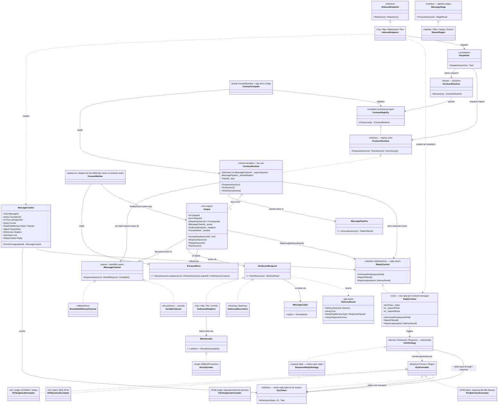

---

## 13. Representative Code

> Illustrative, not complete.

**Envelope + fan‑out clone + reply reference**
```csharp
public sealed class MessageContext
{
    public Guid MessageId { get; } = Guid.NewGuid();
    public required string CorrelationId { get; init; }
    public required int SourceEndpointId { get; init; }
    public required string Format { get; init; }                 // per-input (INV-1); selects parser/stages/formatter
    public ReadOnlyMemory<byte> Payload { get; private set; }    // canonical source bytes (INV-5)
    public object? ParsedView { get; set; }                      // lazily-parsed model, built once by the parse stage
    public IDictionary<string,string> Headers { get; private set; }  // mutable during the shared pipeline; shared read-only snapshot after fan-out (A5)
    public required IAckToken Ack { get; init; }
    public required IReplyContext Reply { get; init; }           // IReplyContext seam (Abstractions); concrete ReplyContext in Core (A2/A3). Created at reception (INV-6); shared across leg clones
    public int LegOutputId { get; private set; }
    public bool IsReplay { get; private set; }                   // set on store-and-forward replay -> suppresses re-reply (see Output)

    public void ReplacePayload(ReadOnlyMemory<byte> p) => Payload = p;
    public void MarkReplay() => IsReplay = true;

    // Per-leg branch: SHARES the immutable payload, parsed view, and header snapshot by reference
    // (legs never mutate them) -> a clone allocates no new dictionary (F-perf4). Same Ack + Reply.
    public MessageContext CloneForLeg(int outputId) => new()
    {
        CorrelationId = CorrelationId, SourceEndpointId = SourceEndpointId, Format = Format,
        Ack = Ack, Reply = Reply, LegOutputId = outputId,
        Payload = Payload, ParsedView = ParsedView, Headers = Headers,   // shared refs, no copy
    };
}
```

**ContractRuntime — per‑input ingress consumers + fan‑out (no ack‑mode knowledge)**
```csharp
public sealed class ContractRuntime : IContractRuntime
{
    private readonly IReadOnlyDictionary<int, IMessageChannel> _ingressQueues; // one per input comm point
    private readonly IMessagePipeline _shared;
    private readonly IReadOnlyList<Output> _legs;
    private readonly int _requiredCount;

    // Routes to the per-input queue by SourceEndpointId (per-input backpressure).
    public ValueTask EnqueueAsync(MessageContext ctx, CancellationToken ct)
        => _ingressQueues[ctx.SourceEndpointId].EnqueueAsync(ctx, ct);

    // Starts one consumer loop per input queue; all share the same pipeline + legs.
    public Task RunAsync(CancellationToken ct)
        => Task.WhenAll(_ingressQueues.Values.Select(q => ConsumeAsync(q, ct)));

    private async Task ConsumeAsync(IMessageChannel ingress, CancellationToken ct)
    {
        await foreach (var ctx in ingress.ReadAllAsync(ct))
        {
            var shared = await _shared.ExecuteAsync(ctx);      // parse + validate/filter/enrich, once
            if (shared.ShortCircuited)                         // filtered/invalid for ALL outputs
            {
                ctx.Reply.ReportFiltered();                    // whole-message drop -> reply "filtered"
                continue;
            }

            // Per-leg input filter: only fan out to legs that accept this message's source.
            var applicable = _legs.Where(l => l.AcceptsInput(ctx.SourceEndpointId)).ToList();
            int requiredCount = applicable.Count(l => l.Required);

            ctx.Reply.OnFannedOut(requiredCount);              // arm per-message; Normal ack fires "received" here
            // Concurrent enqueue: a full REQUIRED leg backpressures (couples this input, §5);
            // sibling inputs' queues are unaffected; optional legs follow their own overflow policy.
            await Task.WhenAll(applicable.Select(l =>
                l.EnqueueAsync(ctx.CloneForLeg(l.OutputId), ct).AsTask()));
            // Enhanced ack / Response fire later, from leg DeliveryResults via ReplyContext.ReportLeg.
        }
    }
}
```

**Output — consumer + delivery + report (+ leg‑targeted replay)**
```csharp
public sealed class Output
{
    public int OutputId { get; }
    public bool Required { get; }
    public IReadOnlySet<int>? FromInputIds { get; }   // null = accepts all inputs (default)
    private readonly IMessageChannel _queue;      // bounded or durable, per policy
    private readonly IOutboundEndpoint _endpoint; // serializes via its codec (+ Retry/Batching decorators)
    private readonly IForwardStore _forward;

    // Per-leg input filter: does this leg accept messages from the given source?
    public bool AcceptsInput(int sourceEndpointId)
        => FromInputIds is null || FromInputIds.Count == 0 || FromInputIds.Contains(sourceEndpointId);

    public ValueTask EnqueueAsync(MessageContext ctx, CancellationToken ct) => _queue.EnqueueAsync(ctx, ct);

    // Leg-targeted replay: reuses THIS leg's delivery path; never re-routes, re-processes, or re-replies.
    public ValueTask ReplayAsync(MessageContext ctx, CancellationToken ct)
    {
        ctx.MarkReplay();                                       // suppresses ReplyContext reporting below
        return _queue.EnqueueAsync(ctx, ct);
    }

    public async Task RunAsync(CancellationToken ct)
    {
        await foreach (var ctx in _queue.ReadAllAsync(ct))
        {
            var result = await _endpoint.SendAsync(ctx, ct);       // endpoint serializes (codec) then sends; retries inside
            if (result.Outcome != DeliveryOutcome.Delivered)
                await _forward.StoreAsync(ctx, OutputId, result.Error); // Pending; ForwardWorker replays into THIS leg
            else if (ctx.IsReplay)
                await _forward.ResolveAsync(ctx, OutputId);            // replay delivered -> clear the store entry

            if (!ctx.IsReplay)
                ctx.Reply.ReportLeg(Required, result);            // FRESH only: a replay never produces a second reply
            if (_queue is DurableChannel dc) dc.Commit(ctx);      // at-least-once: commit after handling (Future: fold into IMessageChannel)
        }
    }
}
```

**`ReplyContext` — one reply per received message, exactly once (+ timeout)**
```csharp
// Neutral leg result carried to the reply authority. Carrying bytes here is what lets
// enhanced-ack pass-through and request-reply responses reach the token (fixes the "no bytes" gap).
public readonly record struct DeliveryResult(
    DeliveryOutcome Outcome,
    string? Error = null,
    ReadOnlyMemory<byte> ResponsePayload = default,
    string? ResponseFormat = null);

// The reply SEAM that MessageContext.Reply is typed as — declared in Abstractions so the envelope never references Core (A2/A3).
public interface IReplyContext
{
    void OnFannedOut(int requiredTotal);          // arm per-message: count of APPLICABLE required legs for THIS message
    void ReportFiltered(string? reason = null);   // shared-pipeline short-circuit -> reply "filtered"
    void ReportLeg(int outputId, bool required, in DeliveryResult result);
}

// ONE per RECEIVED message (created at reception, INV-6). The single reply authority: one-shot + timeout.
// Concrete impl (in Core) of the IReplyContext seam above (A2).
public sealed class ReplyContext : IReplyContext
{
    private readonly MessageContext _ctx;      // wired right after construction
    private readonly IAckStrategy _strategy;   // Normal | Enhanced | Response (chosen per contract/config)
    private readonly ITimer _timeout;          // fires a negative/error reply if required legs never finish
    private readonly List<(int OutputId, DeliveryResult Result)> _legs = [];   // collected required-leg results
    private int _requiredTotal, _requiredDone, _replied;

    public void OnFannedOut(int requiredTotal)
    {
        _requiredTotal = requiredTotal;
        if (_strategy.RepliesOnReceipt)                       // Normal ack: "received" now (on durable accept)
            FireOnce(ReplyOutcome.Received());
    }

    public void ReportFiltered(string? reason = null) => FireOnce(ReplyOutcome.Filtered(reason));

    // Enhanced ack / Response: reflects real delivery; ALL required legs must succeed. Collect each
    // required leg's result so the strategy can COMBINE them (Single relays one by OutputId; Batch wraps N).
    public void ReportLeg(int outputId, bool required, in DeliveryResult result)
    {
        if (!required) return;                               // optional legs never gate the reply
        lock (_legs) _legs.Add((outputId, result));          // record before incrementing so the completing leg sees all
        if (result.Outcome == DeliveryOutcome.Delivered)
        {
            if (Interlocked.Increment(ref _requiredDone) >= _requiredTotal)
                FireOnce(ReplyOutcome.Delivered(OrderedByOutputId()));   // all required ok
        }
        else FireOnce(ReplyOutcome.Failed(result.Error, OrderedByOutputId()));  // one required failure -> NACK
    }

    private void OnTimeout() => FireOnce(ReplyOutcome.Failed("reply timeout", OrderedByOutputId()));

    private void FireOnce(in ReplyOutcome outcome)          // exactly one reply per received message
    {
        if (Interlocked.Exchange(ref _replied, 1) != 0) return;
        _timeout.Dispose();
        // Single: relay the first required leg's captured ack, or generate one ACK/NACK via IAckFormatter.
        _ = _strategy.WriteReplyAsync(_ctx, outcome);
    }
}
```

**Config DTOs (pure, no behavior)**
```csharp
public sealed class ContractOptions
{
    public required string Name { get; init; }
    public required IReadOnlyList<InputOptions> Inputs { get; init; }  // one queue per input (symmetric with Outputs); all must share one Format (INV-1/INV-2)
    public IReadOnlyList<int>? InputIds { get; init; }                 // backward-compat shorthand: flat list -> Inputs with default Channel
    public AckOptions Acknowledgement { get; init; } = new();
    public ResponseOptions Response { get; init; } = new();           // request-reply; mutually exclusive with an enabled Acknowledgement
    public string? Pipeline { get; init; }                            // the ONE shared pipeline name (catalog); runs once; null = no processing stages
    public required IReadOnlyList<OutputOptions> Outputs { get; init; }
}
public sealed class InputOptions
{
    public required int InputId { get; init; }
    public ChannelOptions Channel { get; init; } = new();              // per-input: Capacity, DegreeOfParallelism, Ordered, OverflowPolicy
}
public sealed class OutputOptions
{
    public required int OutputId { get; init; }
    public bool Required { get; init; } = true;
    public IReadOnlyList<int>? FromInputIds { get; init; }             // per-leg input filter: null/empty = all inputs (default)
    public IReadOnlyDictionary<string,string>? RouteWhen { get; init; } // per-leg content filter: facts matched against Headers (AND, exact); null/empty = all messages (default)
    public DeliveryGuarantee DeliveryGuarantee { get; init; } = DeliveryGuarantee.AtMostOnce;
    public ChannelOptions Channel { get; init; } = new();
    public string Encoding { get; init; } = "hl7v2";                  // names a catalog Codecs entry (IMessageCodec) -> per-message encoder
    public BatchingOptions? Batching { get; init; }                   // when set, the endpoint encodes the batch via Batching.Codec (IBatchCodec)
    public RetryOptions Retry { get; init; } = new();
    // no per-output pipeline (YAGNI): all processing is the contract's shared pipeline; formatting is the codec
}
public sealed class BatchingOptions
{
    public bool Enabled { get; init; }
    public string Codec { get; init; } = "avro-zip";                  // names a catalog Codecs entry (IBatchCodec): avro-zip | ndjson | fhir-bundle | csv ...
    public int MaxCount { get; init; } = 500;
    public int MaxLatencyMs { get; init; } = 10_000;
}
public sealed class AckOptions
{
    public bool IsEnabled { get; init; } = true;
    public bool IsEnhanced { get; init; }   // false = normal/original "received" ACK; true = reflects delivery outcome
    public AckShape Shape { get; init; } = AckShape.Single;   // Single (one ACK/MSA) | Batch (BHS..BTS, one MSA per message)
    public int TimeoutMs { get; init; } = 30_000;            // ENHANCED only: max wait for delivery before NACK; <=0 = no timeout (Normal fires on receipt)
}
public sealed class ResponseOptions            // request-reply: return the peer's response instead of an ack
{
    public bool IsEnabled { get; init; }                     // false = use Acknowledgement instead (default)
    public int? FromOutputId { get; init; }                  // the single responder leg (defaults to the sole required output)
    public int TimeoutMs { get; init; } = 30_000;            // mandatory wait; on timeout -> protocol error reply, release source
}
```

---

## 14. Implementation Strategy (phased, greenfield)

This is a **greenfield build**, not an in‑place refactor (see the greenfield note in §10), so there is **no god class to strangle and nothing to delete at the end** (A1). The phases below sequence the **capabilities** of this document to minimise rework: freeze the contracts first, prove one vertical slice, then add breadth (fan‑out, formats/endpoints, durability, hosts) as *registrations behind the already‑frozen interfaces* (P6). The legacy defects the old "Phase 0" existed to fix (unbounded channels, connection‑per‑message, a retry loop with no cap/backoff/terminal state) are **not** a phase here — they are **design constraints baked in from day one**: every queue is bounded (P4), connections are pooled (§3.7), and store‑and‑forward always has an attempt cap + backoff + terminal `Parked` (§3.9). Validate each phase with the TestKit + OTel counters (P9). The critical path is **1 → 3 → 4**; real code only ever *implements the frozen interfaces*, so no phase forces edits to an earlier phase's engine.

| Phase | Objective | Components / layers | Depends on | Validation | Deliverable |
|---|---|---|---|---|---|
`IAckToken`, `IReplyContext`, `IMessageDispatcher`, `IContractResolver`, `IContractRuntime`, `IMessageChannel`,
| **2. Configuration** | Pure option + Catalog DTOs (`Pipelines`/`Codecs`/`Formats`/`Templates`), the **`ContractTemplateResolver`** (flatten `Template`/`Format` → concrete per‑leg encoding), and `IValidateOptions` structural validators (INV‑2, ack XOR response, capacity/DOP > 0, referential integrity, `FromInputIds`, template/format resolution, encoding⇄format) + JSON schema/manifest. | `Configuration` | 1 | validators reject each INV violation; resolver flattens templates; round‑trips the example `contractData.json`/`catalogData.json` | one config truth shared by Agent + Web |
| **3. Core spine — single leg (in‑memory)** | `Dispatcher`/`SourceBasedRouter`/`ContractRegistry`, `ContractRuntime` with **per‑input ingress queues** + **one** leg, `BoundedInMemoryChannel`, shared pipeline (parse once) + leg delivery via outbound endpoint (codec), concrete `ReplyContext`, `ComponentRegistry`, minimal `ContractCompiler`. | `Core` | 1–2 | end‑to‑end TestKit slice: fake inbound → dispatch → pipeline → single leg → fake outbound → reply; graceful drain | the vertical slice all breadth hangs off |
| **4. Multi‑output fan‑out** | `Outputs` list; per‑leg queues; concurrent fan‑out (`Task.WhenAll`); `FromInputIds` filter; required/optional legs; Normal/Enhanced ack; one‑shot + timeout; per‑message required count; multi‑leg `ContractCompiler` + fan‑out validation. | `Core`, `Configuration` | 3 | fan‑out + reply matrix (normal/enhanced; required/optional; partial‑required failure → NACK; filtered; replay = no double‑reply) | many‑in → many‑out |
| **5. Formats & endpoints & codecs** | `Formats.Hl7` (parser, `Hl7v2Codec`, `Hl7SingleAckFormatter`, `Hl7FilterStage`, MSH‑10→`IdempotencyKey`, `DeduplicateStage`); `Endpoints.Tcp/Http/File` (in+out, pooled, real `IAckToken`s); `IMessageCodec`/`IBatchCodec` via catalog `Codecs`. | `Formats.*`, `Endpoints.*` (plug‑ins) | 3–4 | golden‑message HL7 tests; per‑transport reply tests; registration via Component Registry | real transports/formats, zero engine change (OCP) |
| **6. Durability, store‑and‑forward, security** | `DurableChannel` (journal, `AtLeastOnce`); `IForwardStore` impl (`Pending`\|`Parked`, by `OutputId`); `ForwardWorker` (backoff + cap + park); leg‑targeted `ReplayAsync`; crash‑safe outbox (deliver→confirm→resolve); DPAPI `DataDecipher`; `CimS3` + `AvroZipBatchCodec`. | `Persistence`, `Security`, `Endpoints.CimS3` | 3–5 | kill‑during‑processing per‑leg replay; only `AtLeastOnce` persists; `Parked` after cap; replay never re‑routes/re‑acks | durable + acked coexist behind existing seams |
| **7. Hosts, telemetry, request‑reply, Web** | `Service` + `ForwardService` hosts (two owner modes, lease safety‑net) as composition roots; `Telemetry` (OTel meters/gauges/counters); Request‑reply (`ResponseReplyStrategy` + send‑receive endpoints + timeout, §6.1); WebAgent integration (config + Persistence read‑model, `Parked` Requeue/Discard); batch ack. | `hosts/*`, `Telemetry`, `WebAgent` | 1–6 | installer‑compliant publish mapping; full regression + coverage gate | shippable field install |

**Sequencing:** the **critical path is 1 → 3 → 4** (contracts → vertical slice → fan‑out); everything real hangs off that spine. **Parallelisable once Phase 1 is frozen:** `Configuration` (2), each `Formats.*`/`Endpoints.*` plug‑in (5), `Telemetry`/`Security` (Abstractions‑only leaves), and WebAgent config work. **Intentionally postponed:** durability/store‑and‑forward (6) until the in‑memory path is proven; `CimS3`/Avro until the other endpoints are proven; **Request‑reply (§6.1)**, which layers onto the Phase‑4 `ReplyContext` once a send‑receive outbound endpoint exists (a small Phase‑7 addition: `DeliveryResult.ResponsePayload` + `ResponseReplyStrategy` + reply timeout) — no earlier phase blocks on it. Because real code only ever *implements the frozen interfaces*, no phase forces edits to an earlier phase's engine.

---

### Closing

This design maps a Contract's **N inputs → M outputs** onto **one isolated ingress queue per input + one isolated queue per output leg**, with a per‑message **`ReplyContext`** turning M leg `DeliveryResult`s into exactly one reply (ack **or** response). It buys **per‑input isolation** (backpressure, DOP, ordering, observability — each source is independent) and **per‑output isolation** (progress, durability, concurrency, ordering, retry, ops — complete for optional legs; a required leg couples the contract by design, §5), and makes acknowledgement, durability, and batching **orthogonal per‑leg policies** — while every future capability (protocols, stages, outputs, codecs, routing) arrives as a *registration behind an existing interface*, never surgery on a god class.
