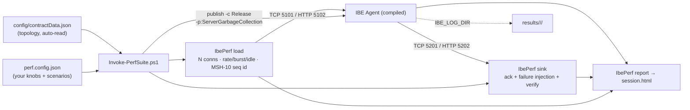

# IBE Agent — Performance Harness (`perf/`)

A **one-shot, config-driven** performance monitor for the IBE Agent. Edit one JSON file, run one
script, and get a **self-contained HTML report** plus the agent's own log for every scenario — all in
a single timestamped folder. It reads the **live `config/contractData.json`** for topology, so ports,
protocols, and contracts are never hard-coded.

> TL;DR — `pwsh -File perf/Invoke-PerfSuite.ps1` → open `perf/results/<timestamp>/session.html`.

---

## 1. What it does



- **`IbePerf`** (`perf/tools/IbePerf`, .NET console) — a black-box driver with three verbs:
  - `load` — drives an inbound endpoint (TCP/MLLP or HTTP), closed- or open-loop, stamps a per-message
    sequence id in **MSH-10**, records send/ack QPC ticks → `latencies.csv` + `summary.json`.
  - `sink` — stands up a listener on **every** outbound endpoint, returns an ack, injects failures
    (ack delay, close-after-N, idle-close, NACK%), verifies the seq id → `sink.csv` + `sink.json`.
  - `report` — merges everything into `session.html` (inline SVG charts, tables, SLO pass/fail,
    baseline diff). No CDN/external assets → renders offline on an air-gapped server.
- **`Invoke-PerfSuite.ps1`** — the orchestrator: build → per scenario {start sink, start agent with
  `IBE_LOG_DIR` pointing at the report folder, warm up, capture counters, run load, tear down} → report.
- **`Export-PerfBundle.ps1`** — packages the agent + harness **self-contained** into a copy-pasteable
  folder + zip for a high-performance server (no SDK/source needed there).

---

## 2. Quick start (dev machine)

```powershell
# Full suite (builds Release, runs all scenarios, opens the report)
pwsh -File perf/Invoke-PerfSuite.ps1

# One scenario, skip the rebuild
pwsh -File perf/Invoke-PerfSuite.ps1 -Scenario baseline -SkipBuild

# Compare against a previous run
pwsh -File perf/Invoke-PerfSuite.ps1 -Baseline perf/results/20260807-120000

# See the resolved plan without running anything
pwsh -File perf/Invoke-PerfSuite.ps1 -DryRun
```

## 3. Run on a high-performance server (portable bundle)

```powershell
# On the dev machine — produce a self-contained bundle + zip:
pwsh -File perf/Export-PerfBundle.ps1                 # win-x64 by default
pwsh -File perf/Export-PerfBundle.ps1 -Runtime linux-x64
```
Copy `perf/bundle/ibe-perf-<rid>` (or the zip) to the server, then:
```
Run-Perf.cmd            (Windows)   — or —   pwsh -File Invoke-PerfSuite.ps1
```
Open `results/<timestamp>/session.html`. The agent and `IbePerf` are self-contained — **no .NET install
required**. `dotnet-counters` is optional (enables GC/CPU capture).

---

## 4. Configuration (`perf.config.json`)

Backed by `perf.config.schema.json` (editor intellisense/validation). Top-level knobs:

| Section | Key | Meaning |
|---|---|---|
| `build` | `serverGc` | **Server-GC knob.** Baked into the Release build (`serverGcMode:"publish"`) or applied at launch (`"runtime"` → `DOTNET_gcServer`). |
| `build` | `configuration`, `concurrentGc`, `rebuild`, `runtime`, `selfContained` | Build config; concurrent GC; republish; export RID; self-contained export. |
| `agent` | `projectPath`, `exeName`, `configDir`, `startupTimeoutSec` | Agent host to publish; live config folder (topology source, copied next to the agent). |
| `report` | `outputDir`, `openAfter`, `baselineDir`, `captureCounters` | Report options + optional baseline diff + GC/CPU capture toggle. |
| `slo` | `p99RoundTripMs`, `zeroLoss`, `maxThroughputRegressionPct` | Pass/fail thresholds (drive the PASS/FAIL column). |
| `defaults` | — | Base scenario values; each scenario inherits and overrides these. |
| `scenarios[]` | — | The matrix (see below). |

**Per-scenario fields** (override `defaults`):

| Field | Meaning |
|---|---|
| `mode` | `closed` (wait for ack → latency) or `open` (paced at `rateMsgsPerSec` → throughput/backpressure). |
| `connections` | Concurrent inbound connections. |
| `durationSec`, `warmupSec` | Measured window and discarded warm-up (excludes JIT + cold-connection). |
| `rateMsgsPerSec` | Open-loop target across all connections; `0` = unbounded. |
| `inputId` | Which `SourceEndpointId` to drive (default: first contract's first input). |
| `burstSize` + `idleGapSec` | Send bursts with idle gaps — **exercises the stale-connection reconnect**. |
| `messageMix[]` | Weighted `{type, sizeBytes, weightPct}` (ADT/ORU/ORM; `sizeBytes` pads large payloads). |
| `sink.ackDelayMs`, `jitterMs` | Simulate a slow downstream. |
| `sink.failure.{closeAfterN, nackPct, idleCloseMs}` | Failure injection. |
| `agentOverrides.loggingTier` | Optional: patch `Philips.IBE` log level + restart the agent. Omit to test the **current** contract as-is. |

> By default a scenario tests your **current** `contractData.json` unmodified. Only `agentOverrides`
> triggers a sandboxed config change + agent restart.

---

## 5. Output layout

```
perf/results/<yyyyMMdd-HHmmss>/
  session.html          # the report (open this)
  sysinfo.json          # machine, CPU, RAM, OS, .NET, GC mode, git commit, contract
  slo.json
  <scenario>/
    scenario.json       # the fully-merged, effective config for this run
    latencies.csv       # per-message: seq, conn, sendTick, ackTick, rttMs, warmup, ack, bytes
    summary.json        # percentiles, throughput, ack distribution
    sink.csv, sink.json # received seq ids (loss/dupe/reorder), nacks
    counters.csv        # dotnet-counters GC/CPU (if available)
    logs/               # the AGENT's NLog file for this scenario + console out/err
```

**Report contents:** sysinfo header · scenario summary table (throughput, p50/p95/p99/p99.9/max, loss,
dup, out-of-order, NACK, CPU%, alloc MB/s, %GC, **SLO pass/fail**) · throughput + p99 SVG charts ·
optional baseline %-diff.

---

## 6. Latency semantics (read this before trusting numbers)

- The **round-trip** in the report is the client-observed `send → agent source-ack` time. With
  **Normal** ack that is ~receive+enqueue; with **Enhanced** ack it includes the downstream round-trip.
- `send` cost in the agent's own logs additionally includes the destination MLLP ack (because
  `ExpectReply=true`). To isolate the **pure internal** engine time (received → begin-send), join
  `latencies.csv` (load send tick) with `sink.csv` (sink receive tick) by seq id — both use QPC ticks
  that are comparable across processes on one machine.
- Always label numbers by **mode** (closed vs open) and **delivery guarantee / ack strategy**; a single
  latency figure is meaningless without them.

---

## 7. Extending the harness

### Add a scenario
Edit `perf.config.json` → add an object to `scenarios[]`. No code, no rebuild of the tool.

### Add a new protocol peer (e.g. WebSocket, or File load)
Topology already flows from `contractData.json`; the tool keys behaviour off `PerfEndpoint.Proto`.
To support a new protocol end-to-end:
1. **Topology** — in `perf/tools/IbePerf/Model.cs`, `Topology.Load` maps each config endpoint kind to a
   `PerfEndpoint(Proto, Role, Id, Host, Port, Url, Format)`. Add parsing for the new
   `Endpoints.<Kind>Inbound` / `<Kind>Outbound` arrays, tagging `Proto` (e.g. `"ws"`, `"file"`).
2. **Sink** — in `SinkVerb.RunAsync`, add a branch for the new `ep.Proto` that stands up the listener
   (e.g. a `WebSocket` server, or a folder watcher for File) and enqueues a `Recv(seq, Qpc.Now(), proto, order)`.
3. **Load** — in `LoadVerb.RunAsync` / `ResolveTarget`, add a `<Proto>WorkerAsync` mirroring
   `TcpWorkerAsync`: build the message (`Hl7Corpus.Build`), send, capture `send`/`ack` ticks, enqueue a `Rec`.
4. Nothing else changes — `report` is protocol-agnostic (it reads `summary.json`/`sink.json`).

Keep peers behind these two extension points (`sink` branch + `load` worker); the corpus, framing, QPC
clock, percentile math, and report are shared.

### Add a metric
Add the field to the `summary`/`sink` JSON written by the verbs, then render it in
`ReportVerb.BuildHtml` (add a table column or a `BarChart` call).

---

## 8. Requirements & troubleshooting

- **Dev machine:** .NET 10 SDK, PowerShell 7 (`pwsh`). **Target server:** nothing (self-contained bundle);
  optional `dotnet-counters` (`dotnet tool install -g dotnet-counters`) for GC/CPU.
- **Ports already in use** → the agent won't start / sink can't bind. Stop stray
  `Philips.IBE.IBEAgent.Service` processes (the harness does this at start) or change ports in `contractData.json`.
- **Agent didn't start** → see `<scenario>/logs/agent.out|err` and the NLog file in `logs/`.
- **GC/CPU columns empty** → `dotnet-counters` not on PATH; install it or set `report.captureCounters:false`.
- **Server GC not applied** → check `sysinfo.json.gcMode`; `serverGcMode:"publish"` bakes it into the
  build's `.runtimeconfig.json`, `"runtime"` sets `DOTNET_gcServer` at launch.
- **HTTP sink can't bind** → non-loopback prefixes need a urlacl; the harness uses `localhost`, which does not.

---

## 9. Design notes

- The tool references **no engine code** on purpose — it is an independent black-box driver (its own MLLP
  framing is the wire oracle), so it publishes standalone for the portable bundle.
- One backward-compatible repo change enables per-session logs: `nlog.config` uses
  `${environment:IBE_LOG_DIR:whenEmpty=${basedir}/logs}`; unset (production) it falls back to the exe's
  `logs/` folder.
- Prefer **predictable low latency + zero loss** over chasing peak throughput; monitor **p99**, queue
  depth, and allocations, and compare against a stored **baseline** rather than a single run.
